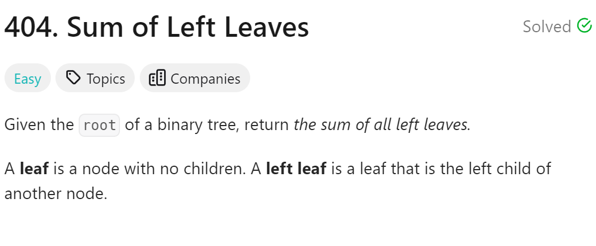

# 404. Sum of Left Leaves



## 难点
本题的难点在于，判断左叶子只能通过父节点去判断

## C++
``` C++
int sumOfLeftLeaves(TreeNode* root) {
    if (root==nullptr) return 0;
    int leftval=0,rightval=0;
    if (root->left&& root->left->left==nullptr&&root->left->right==nullptr)
        leftval=root->left->val;
    else
        leftval=sumOfLeftLeaves(root->left);
    rightval=sumOfLeftLeaves(root->right);
    int sum=leftval+rightval;
    return sum;
}
```

## Python
``` Python
def sumOfLeftLeaves(self, root: Optional[TreeNode]) -> int:
    if not root:
        return 0
    if root.left and not root.left.left and not root.left.right:
        leftval=root.left.val
    else:
        leftval=self.sumOfLeftLeaves(root.left)
    rightval=self.sumOfLeftLeaves(root.right)
    return leftval+rightval
```