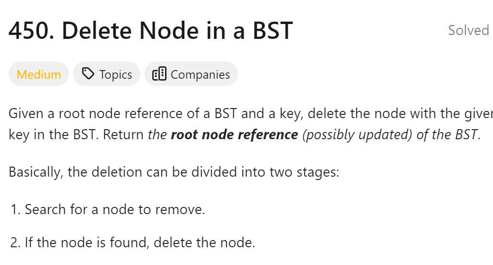

# 450. Delete Node in a BST



## 难点
有以下五种情况：

第一种情况：没找到删除的节点，遍历到空节点直接返回了
找到删除的节点
第二种情况：左右孩子都为空（叶子节点），直接删除节点， 返回NULL为根节点
第三种情况：删除节点的左孩子为空，右孩子不为空，删除节点，右孩子补位，返回右孩子为根节点
第四种情况：删除节点的右孩子为空，左孩子不为空，删除节点，左孩子补位，返回左孩子为根节点
第五种情况：左右孩子节点都不为空，则将删除节点的左子树头结点（左孩子）放到删除节点的右子树的最左面节点的左孩子上，返回删除节点右孩子为新的根节点。

## C++
``` C++
class Solution {
public:
    TreeNode* deleteNode(TreeNode* root, int key) {
        if (!root) return root;
        if (key==root->val)
        {
            if (!root->left&&!root->right)
            {
                delete root;
                return nullptr;
            }
            else if (!root->left&&root->right)
            {
                TreeNode* tmp=root->right;
                delete root;
                return tmp;
            }
            else if (root->left&&!root->right)
            {
                TreeNode* tmp=root->left;
                delete root;
                return tmp;
            }
            else {
                TreeNode* tmp=root->right;
                while(tmp->left)
                    tmp=tmp->left;
                tmp->left=root->left;
                tmp=root->right;
                delete root;
                return tmp;
            }
        }

        if (key<root->val) root->left=deleteNode(root->left,key);
        if (key>root->val) root->right=deleteNode(root->right,key);
        return root;
    }
};
```

## Python
``` Python
class Solution:
    def deleteNode(self, root: Optional[TreeNode], key: int) -> Optional[TreeNode]:
        if not root:
            return root
        if key==root.val:
            if not root.left and not root.right:
                del root
                return None
            elif not root.left and root.right:
                tmp=root.right
                del root
                return tmp
            elif root.left and not root.right:
                tmp=root.left
                del root
                return tmp
            else:
                tmp=root.right
                while tmp.left:
                    tmp=tmp.left
                tmp.left=root.left
                tmp=root.right
                del root
                return tmp
        if key<root.val:
            root.left=self.deleteNode(root.left,key)
        if key>root.val:
            root.right=self.deleteNode(root.right,key)
        return root
```