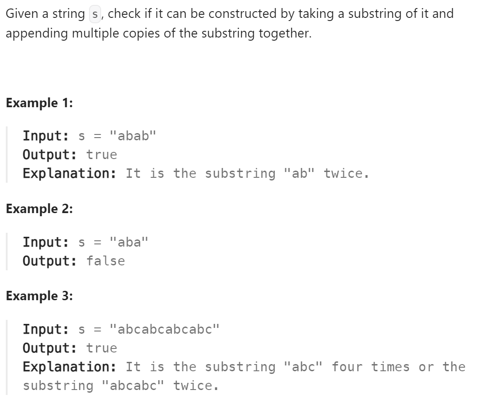

# 459 Repeated Substring Pattern


## 难点
本题使用了kmp算法，难点在于数学推导
字符串长度减去最长相同前后缀的长度就是最小重复字符串的长度。
如果这个算出来长度是字符串长度的因数，即取模等于零，那么这代表该小字符串是最小重复字符串

## C++
``` C++
void getNext(vector<int> &next,string s)
{
    int j=0;
    next[0]=0;
    for (int i=1;i<s.size();i++)
    {
        while (j>0&&s[i]!=s[j])
            j=next[j-1];
        if (s[i]==s[j])
            j++;
        next[i]=j;
    }
}

bool repeatedSubstringPattern(string s) {
    int len=s.size();
    vector<int> next(len);
    getNext(next,s);
    if (next[len-1]!=0&&len%(len-next[len-1])==0)
        return true;
    else
        return false;
}
```

## Python
``` Python
def getNext(self, next, s):
    j=0
    next[0]=0
    for i in range(1,len(s)):
        while j>0 and s[i]!=s[j]:
            j=next[j-1]
        if s[i]==s[j]:
            j+=1
        next[i]=j

def repeatedSubstringPattern(self, s: str) -> bool:
    length=len(s)
    next=[0]*length
    self.getNext(next,s)
    if next[length-1]!=0 and length%(length-next[length-1])==0:
        return True
    else:
        return False
```