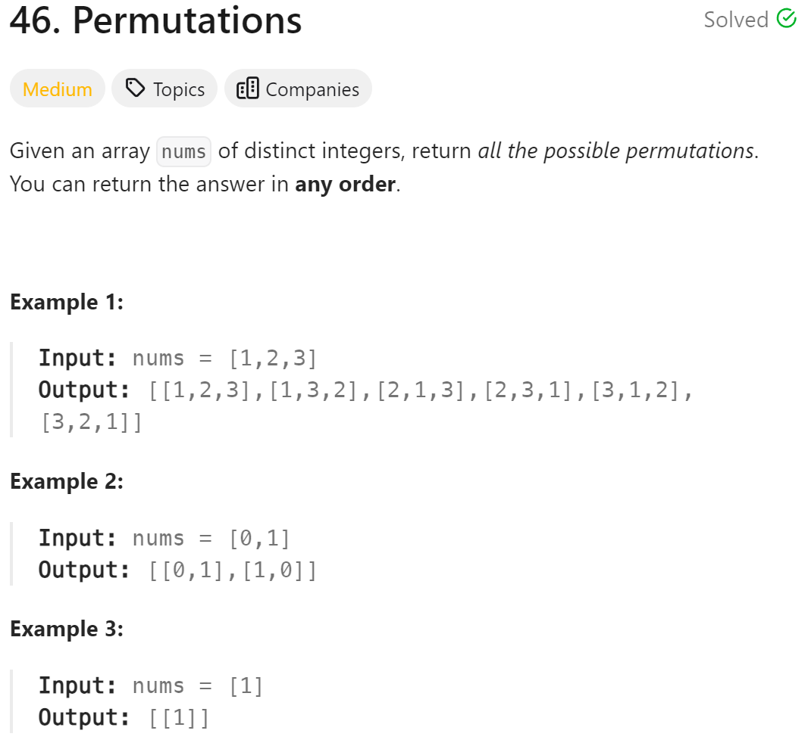

# 46. Permutations


## 难点
因为是全排列，所以每次回溯都要从第一个数字开始重新循环

## C++
``` C++
class Solution {
public:
    vector<vector<int>> ans;
    vector<int> path;
    void backtracking(vector<int>& nums,vector<bool>& used)
    {
        if (path.size()==nums.size())
        {
            ans.push_back(path);
            return;
        }
        for (int i=0;i<nums.size();i++)
        {
            if (used[i]) continue;
            used[i]=true;
            path.push_back(nums[i]);
            backtracking(nums,used);
            path.pop_back();
            used[i]=false;
        }
    }

    vector<vector<int>> permute(vector<int>& nums) {
        vector<bool> used(nums.size(),false);
        backtracking(nums,used);
        return ans;
    }
};
```
