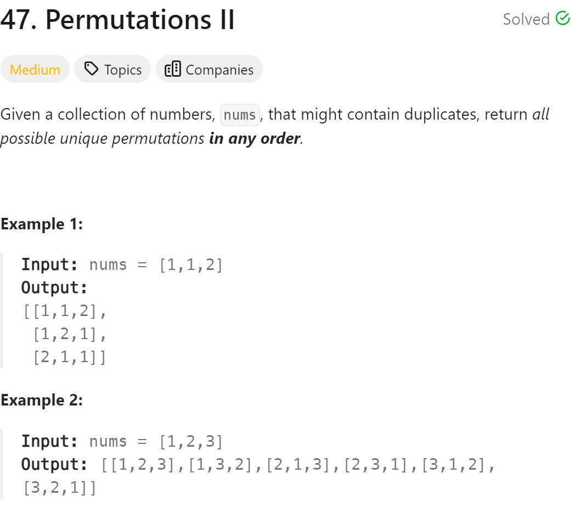

# 47. Permutations II


## 难点
难点在于去重，这里可以用set的方法做，也可以先排序，然后用used作去重

## C++
``` C++
class Solution {
public:
    vector<vector<int>> ans;
    vector<int> path;
    void backtracking(vector<int>& nums,vector<bool>& used)
    {
        if (path.size()==nums.size())
        {
            ans.push_back(path);
            return;
        }
        unordered_set<int> uset;
        for (int i=0;i<nums.size();i++)
        {
            if (used[i]) continue;
            if (uset.find(nums[i])!=uset.end()) continue;
            uset.insert(nums[i]);
            used[i]=true;
            path.push_back(nums[i]);
            backtracking(nums,used);
            path.pop_back();
            used[i]=false;
        }
    }

    vector<vector<int>> permuteUnique(vector<int>& nums) {
        vector<bool> used(nums.size(),false);
        backtracking(nums,used);
        return ans;
    }
};
```

## Python
``` Python
class Solution:
    def backtracking(self,ans,path,used,nums):
        if len(path)==len(nums):
            ans.append(path[:])
            return
        uset=set()
        for i in range(0,len(nums)):
            if used[i]:
                continue
            if nums[i] in uset:
                continue
            uset.add(nums[i])
            path.append(nums[i])
            used[i]=True
            self.backtracking(ans,path,used,nums)
            used[i]=False
            path.pop()

    def permuteUnique(self, nums: List[int]) -> List[List[int]]:
        ans=[]
        path=[]
        used=[False]*len(nums)
        self.backtracking(ans,path,used,nums)
        return ans
```