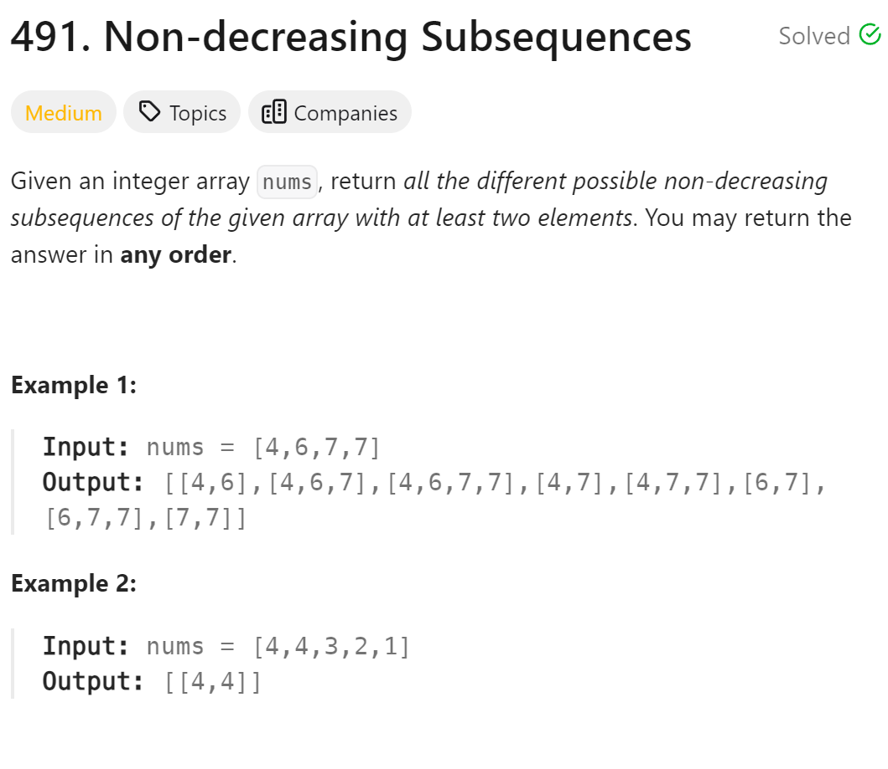

# 491. Non-decreasing Subsequences


## 难点
对于同一个树层要做去重操作

## C++
``` C++
class Solution {
public:
    vector<vector<int>> ans;
    vector<int> path;
    void backtracking(vector<int>&nums,int startIndex)
    {
        if (path.size()>1) ans.push_back(path);
        if (startIndex>=nums.size())
            return;
        unordered_set<int> used;
        for (int i=startIndex;i<nums.size();i++)
        {
            if ((!path.empty()&&nums[i]<path.back())||
            (used.find(nums[i])!=used.end())) continue;
            used.insert(nums[i]);
            path.push_back(nums[i]);
            backtracking(nums,i+1);
            path.pop_back();
        }
    }

    vector<vector<int>> findSubsequences(vector<int>& nums) {
        backtracking(nums,0);
        return ans;
    }
};
```

## Python
``` Python
class Solution:
    def findSubsequences(self, nums: List[int]) -> List[List[int]]:
        ans = []
        path = []
        self.backtracking(nums, 0, path, ans)
        return ans
    
    def backtracking(self,nums,startIndex,path,ans):
        if len(path)>1:
            ans.append(path[:])
        uset=set()
        for i in range(startIndex,len(nums)):
            if (path and path[-1]>nums[i]) or nums[i] in uset:
                continue
            uset.add(nums[i])
            path.append(nums[i])
            self.backtracking(nums,i+1,path,ans)
            path.pop()
```