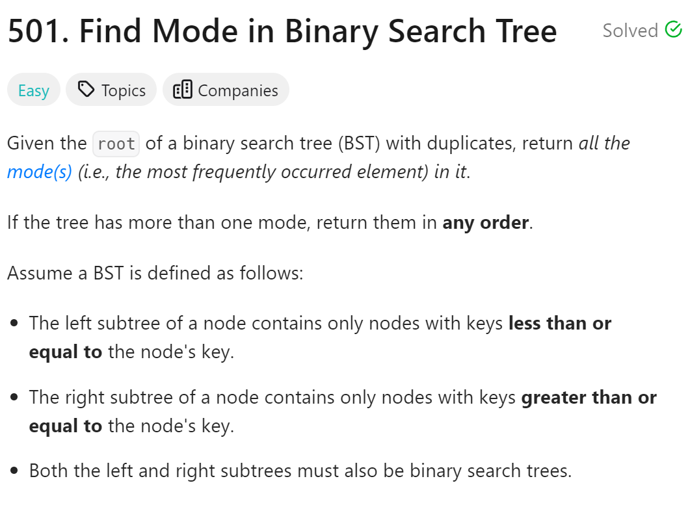
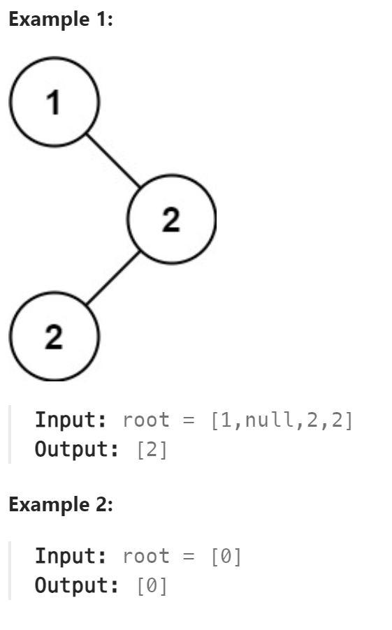

# 501. Find Mode in Binary Search Tree



## 难点
这里的mode指的是众数，即出现频率最高的数，因为二叉搜索树的有序性，所以我采用中序遍历的方式来遍历树。
对每一个当前最高的频率的众数都放入ans数组，当最高频率被打破的时候，刷新最高频率，清空ans数组，并填入新的众数。

## C++
``` C++
class Solution {
public:
    int maxCount=0;
    int count=0;
    TreeNode* pre=nullptr;
    void traversal(TreeNode* cur, vector<int>& ans)
    {
        if (cur->left) traversal(cur->left,ans);
        if (!pre) count=1;
        else if (pre->val==cur->val) count++;
        else count=1;
        pre=cur;
        if (count==maxCount) ans.push_back(cur->val);
        else if (count>maxCount){
            maxCount=count;
            ans.clear();
            ans.push_back(cur->val);
        }
        
        if (cur->right) traversal(cur->right,ans);
    }

    vector<int> findMode(TreeNode* root) {
        vector<int> ans;
        traversal(root,ans);
        return ans;
    }
};
```

## Python
``` Python
class Solution:
    def __init__(self):
        self.pre=None
        self.count=0
        self.maxCount=0

    def traversal(self,cur,ans):
        if cur.left:
            self.traversal(cur.left,ans)
        if not self.pre:
            self.count=1
        elif self.pre.val==cur.val:
            self.count+=1
        else:
            self.count=1
        self.pre=cur

        if self.count==self.maxCount:
            ans.append(cur.val)
        elif self.count>self.maxCount:
            ans.clear()
            self.maxCount=self.count
            ans.append(cur.val)

        if cur.right:
            self.traversal(cur.right,ans)

    def findMode(self, root: Optional[TreeNode]) -> List[int]:
        ans=[]
        self.traversal(root,ans)
        return ans
```