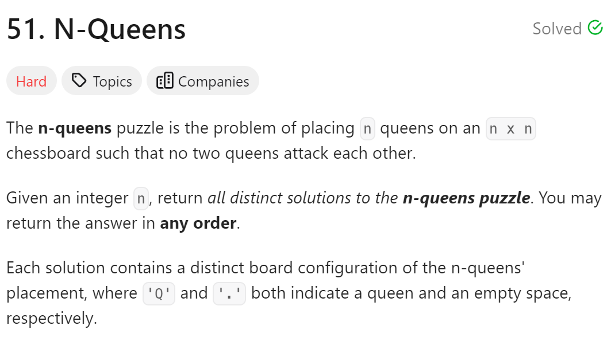
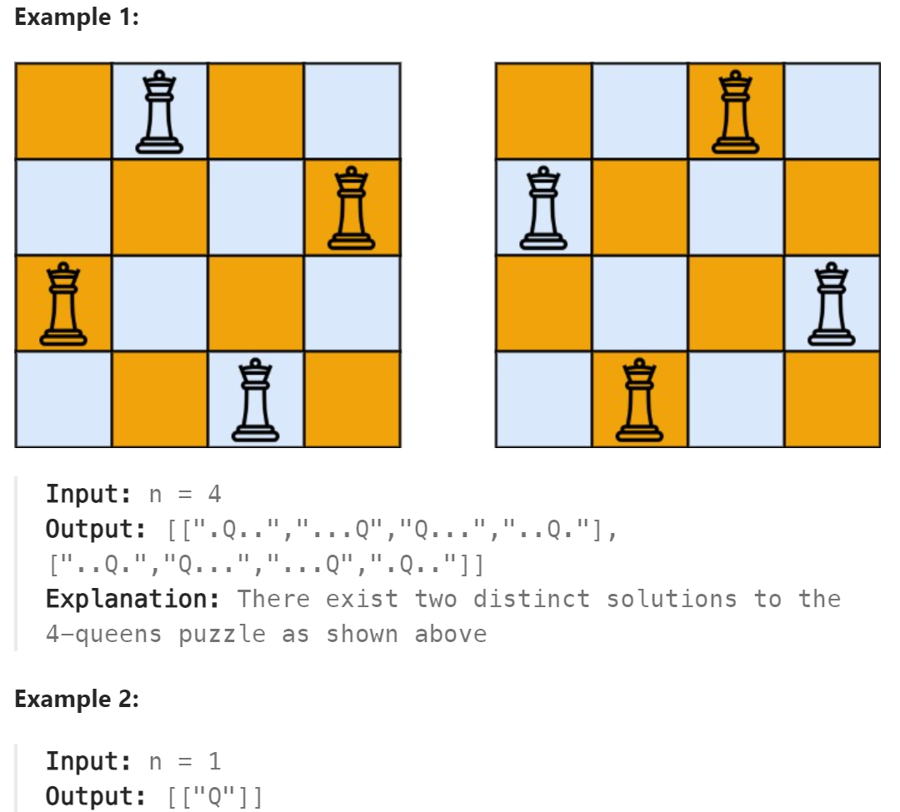

# 51. N-Queens



## 难点
使用回溯算法

## C++
``` C++
class Solution {
public:
    vector<vector<string>> ans;
    void backtracking(int n,int row, vector<string>& board)
    {
        if (row==n)
        {
            ans.push_back(board);
            return;
        }
        for(int col=0;col<n;col++)
        {
            if (!isValid(row,col,n,board))
                continue;
            board[row][col]='Q';
            row++;
            backtracking(n,row,board);
            row--;
            board[row][col]='.';
        }
    }

    bool isValid(int row, int col, int n, vector<string>& board)
    {
        for (int i=0;i<n;i++)
        {
            if (board[i][col]=='Q')
                return false;
        }
        for (int i=row-1,j=col-1;i>=0&&j>=0;i--,j--)
        {
            if (board[i][j]=='Q')
                return false;
        }
        for (int i=row-1,j=col+1;i>=0&&j<n;i--,j++)
        {
            if (board[i][j]=='Q')
                return false;
        }
        return true;
    }

    vector<vector<string>> solveNQueens(int n) {
        vector<string> board(n,string(n,'.'));
        backtracking(n,0,board);
        return ans;
    }
};
```

