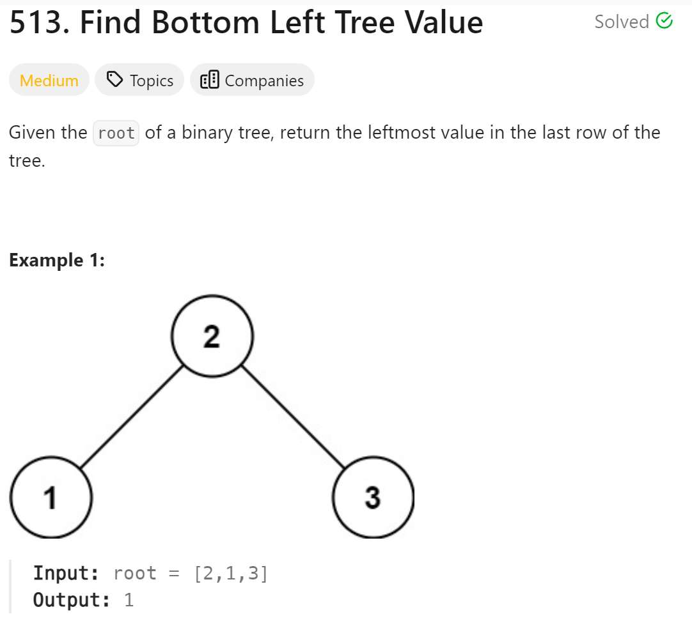
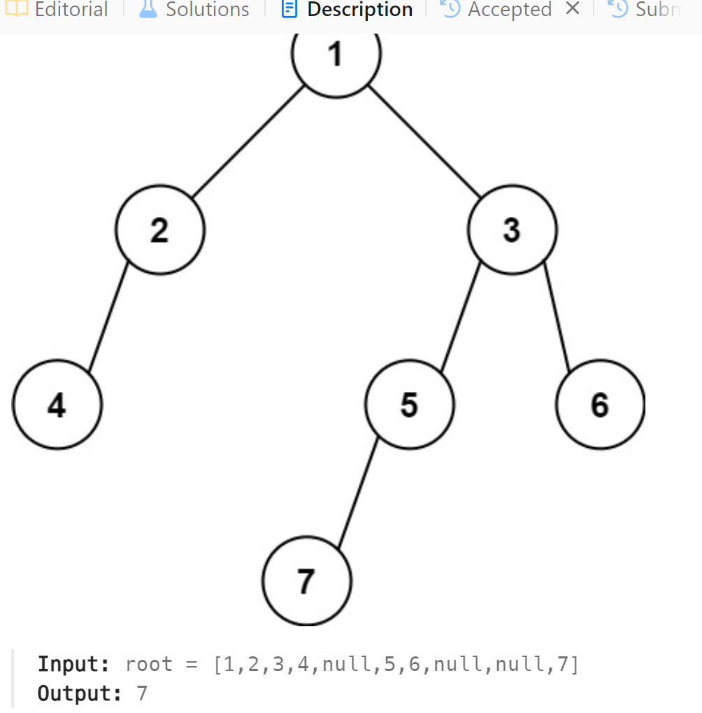

# 513. Find Bottom Left Tree Value



## 难点

## C++
``` C++
int findBottomLeftValue(TreeNode* root) {
    queue<TreeNode*> que;
    que.push(root);
    TreeNode* ans=nullptr;
    while(!que.empty())
    {
        if (!que.empty()) 
            ans=que.front();
        int size=que.size();
        for (int i=0;i<size;i++)
        {
            TreeNode* tmp=que.front();
            if (tmp->left)
                que.push(tmp->left);
            if (tmp->right)
                que.push(tmp->right);
            que.pop();
        }
    }
    return ans->val;
}
```

## Python
``` Python
def findBottomLeftValue(self, root: Optional[TreeNode]) -> int:
    que=deque([root])
    while que:
        if que:
            ans=que[0]
        size=len(que)
        for i in range(size):
            if que[0].left:
                que.append(que[0].left)
            if que[0].right:
                que.append(que[0].right)
            que.popleft()
    return ans.val
```