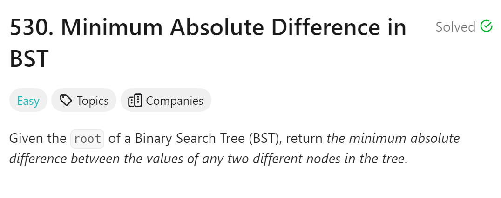
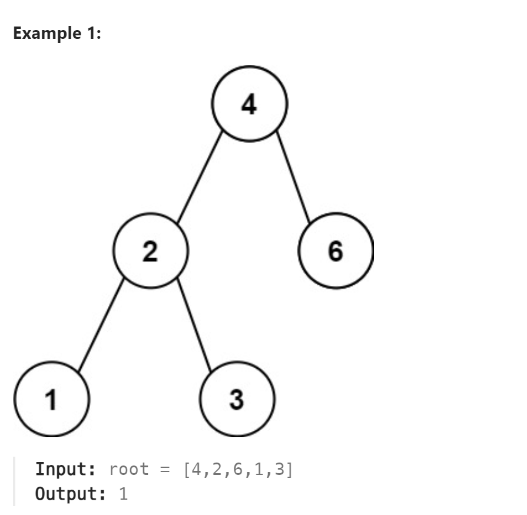

# 530. Minimum Absolute Difference in BST



## 难点
因为二叉搜索树的有序性，所以记录前一个结点可以帮助寻找两节点的最小差值

## C++
``` C++
class Solution {
public:
    TreeNode* pre=nullptr;
    int diff=INT_MAX;
    int getMinimumDifference(TreeNode* root) {
        if (root->left) getMinimumDifference(root->left);
        if (pre)
            diff=min(diff,root->val-pre->val);
        pre=root;
        if (root->right) getMinimumDifference(root->right);
        return diff;
    }
};
```

## Python
``` Python
class Solution:
    def __init__(self):
        self.pre=None
        self.diff=float('inf')

    def getMinimumDifference(self, root: Optional[TreeNode]) -> int:
        if root.left:
            self.getMinimumDifference(root.left)
        if self.pre:
            self.diff=min(self.diff,root.val-self.pre.val)
        self.pre=root
        if root.right:
            self.getMinimumDifference(root.right)
        return self.diff
```