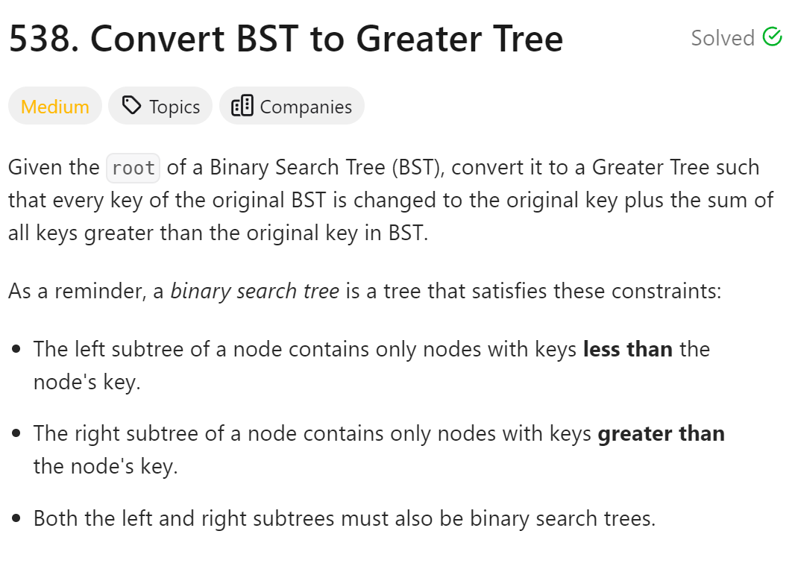
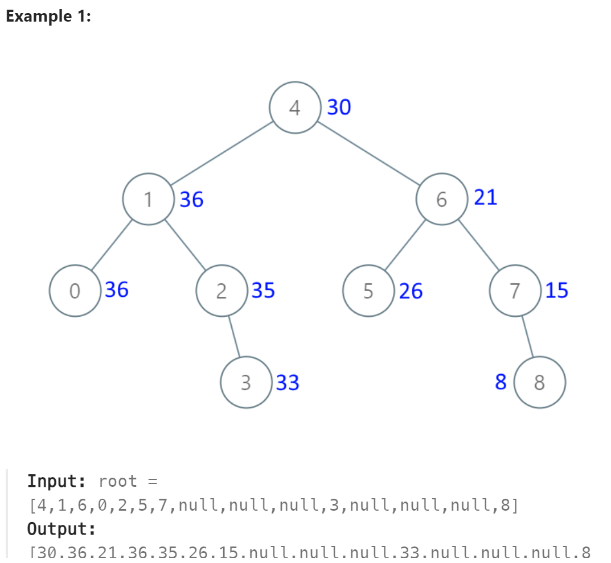

# 538. Convert BST to Greater Tree



## 难点
本题使用右中左的方式遍历

## C++
``` C++
class Solution {
public:
    void traversal(TreeNode* cur, int& sum)
    {
        if (cur==nullptr) return;
        if (cur->right) traversal(cur->right,sum);
        sum+=cur->val;
        cur->val=sum;
        if (cur->left) traversal(cur->left,sum);
    }

    TreeNode* convertBST(TreeNode* root) {
        int sum=0;
        traversal(root,sum);
        return root;
    }
};
```

## Python
``` Python
class Solution:
    def __init__(self):
        self.sum=0

    def traversal(self, cur):
        if not cur:
            return None
        if cur.right:
            self.traversal(cur.right)
        self.sum+=cur.val
        cur.val=self.sum
        if cur.left:
            self.traversal(cur.left)

    def convertBST(self, root: Optional[TreeNode]) -> Optional[TreeNode]:
        self.traversal(root)
        return root
```