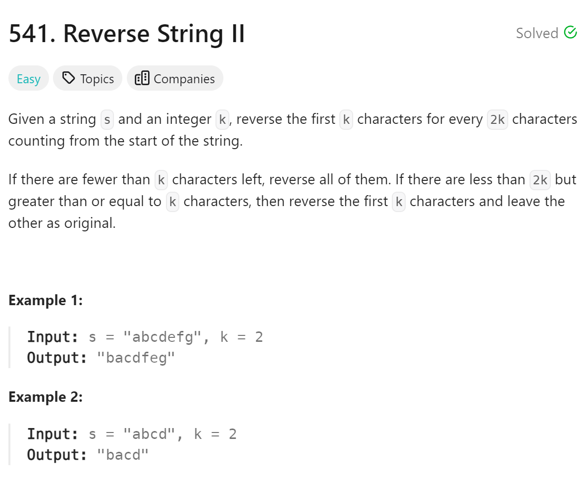

# 541 Reverse String II


## 难点
难点在于理解reverse的两个参数，他们的关系是[first,last),从第一个参数index开始颠倒，第二个参数不参与颠倒。

## C++
``` C++
string reverseStr(string s, int k) {
    for (int i=0;i<s.size();i+=(2*k))
    {
        if (i+k<=s.size())
        {
            reverse(s.begin()+i,s.begin()+i+k);
        }
        else
        {
            reverse(s.begin()+i,s.end());
        }
    }
    return s;
}
```
