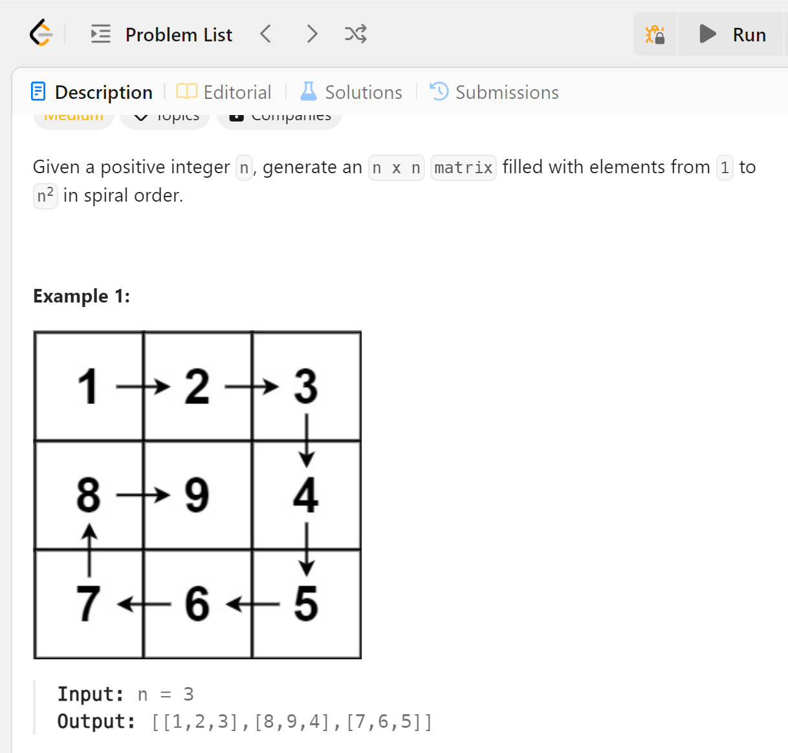

# 59 Spiral Matrix II


## 难点
本题难点在于如何确定矩阵的边界，在C++中，我使用direct变量来控制填写的方向，并设置边界条件。
在Python中，我先确定四面的边界，然后对其收缩，每次填入数字确保一行或者一列被填满

## C++
``` C++
vector<vector<int>> generateMatrix(int n) {
    vector<vector<int>> ans(n,vector<int>(n,0));
    int count=1, row=0, arr=0, dir=1;
    while(count<=n*n)
    {
        ans[row][arr]=count;
        if (count==n*n) break;
        if (dir==1)
        {
            if (arr+1>=n||ans[row][arr+1]!=0)
            {
                dir++;
                continue;
            }
            arr++;
        }
        else if (dir==2)
        {
            if (row+1>=n||ans[row+1][arr]!=0)
            {
                dir++;
                continue;
            }
            row++;
        }
        else if (dir==3)
        {
            if (arr-1<0||ans[row][arr-1]!=0)
            {
                dir++;
                continue;
            }
            arr--;
        }
        else
        {
            if (row-1<0||ans[row-1][arr]!=0)
            {
                dir=1;
                continue;
            }
            row--;
        }
        count++;
    }
    return ans;
}
```

## Python
``` Python
def generateMatrix(self, n: int) -> List[List[int]]:
    ans=[[0 for _ in range(n)]for _ in range(n)]
    left, right, top, bottom, count=0,n-1,0,n-1,1
    while left<=right and top<=bottom:
        for i in range(left, right+1):
            ans[top][i]=count
            count+=1
        top+=1
        for i in range(top, bottom+1):
            ans[i][right]=count
            count+=1
        right-=1
        for i in range(right, left-1, -1):
            ans[bottom][i] = count
            count += 1
        bottom -= 1
        for i in range(bottom, top-1, -1):
            ans[i][left] = count
            count += 1
        left += 1
    return ans
```