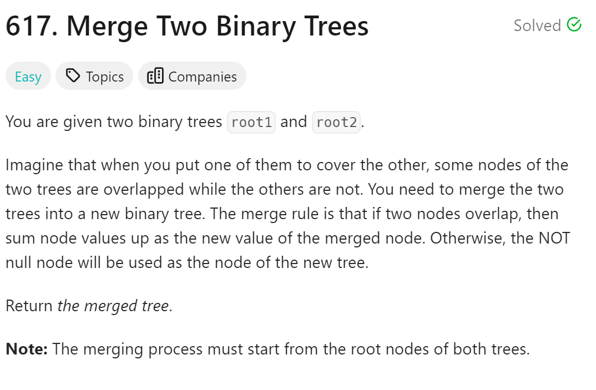
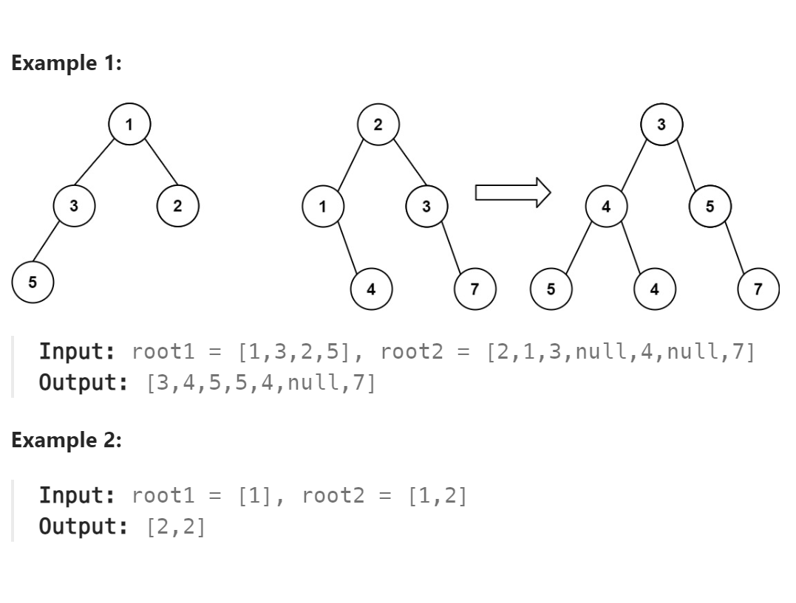

# 617. Merge Two Binary Trees



## 难点

## C++
``` C++
TreeNode* mergeTrees(TreeNode* root1, TreeNode* root2) {
    if (!root1&&!root2) return nullptr;
    if (!root1) 
        root1=new TreeNode(0);
    if (root2)
        root1->val+=root2->val;
    if (root2) {
        root1->left=mergeTrees(root1->left,root2->left);
        root1->right=mergeTrees(root1->right,root2->right);
    }
    else
    {
        root1->left=mergeTrees(root1->left,nullptr);
        root1->right=mergeTrees(root1->right,nullptr);
    }
    
    return root1;
}
```

## Python
``` Python
def mergeTrees(self, root1: Optional[TreeNode], root2: Optional[TreeNode]) -> Optional[TreeNode]:
    if not root1:
        return root2
    if not root2:
        return root1
    root1.val+=root2.val
    root1.left=self.mergeTrees(root1.left,root2.left)
    root1.right=self.mergeTrees(root1.right,root2.right)
    return root1
```