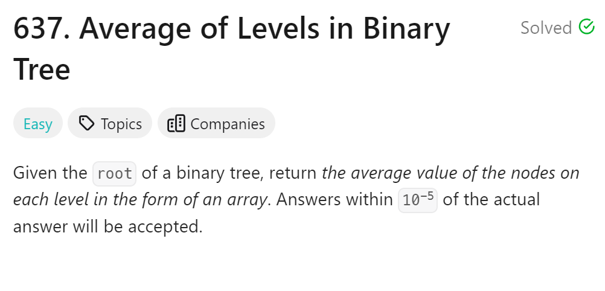
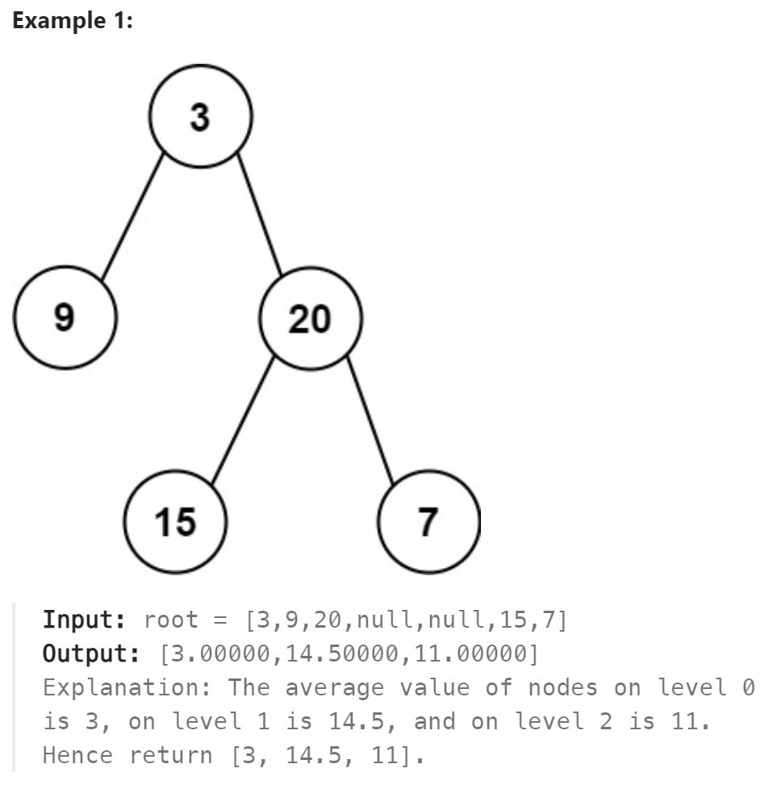

# 637. Average of Levels in Binary Tree



## 难点

## C++
``` C++
vector<double> averageOfLevels(TreeNode* root) {
    vector<double> ans;
    if (root==nullptr) return ans;
    queue<TreeNode*> que;
    que.push(root);
    while (!que.empty())
    {
        double avg=0;
        int size=que.size();
        for (int i=0;i<size;i++)
        {
            avg+=que.front()->val;
            if (que.front()->left) que.push(que.front()->left);
            if (que.front()->right) que.push(que.front()->right);
            que.pop();
        }
        avg/=size;
        ans.push_back(avg);
    }
    return ans;
}
```

## Python
``` Python
def averageOfLevels(self, root: Optional[TreeNode]) -> List[float]:
    ans=[]
    if not root:
        return ans
    que=deque([root])
    while que:
        size=len(que)
        tmp=0.0
        for i in range(size):
            tmp+=que[0].val
            if que[0].left:
                que.append(que[0].left)
            if que[0].right:
                que.append(que[0].right)
            que.popleft()
        tmp/=size
        ans.append(tmp)
    return ans
```