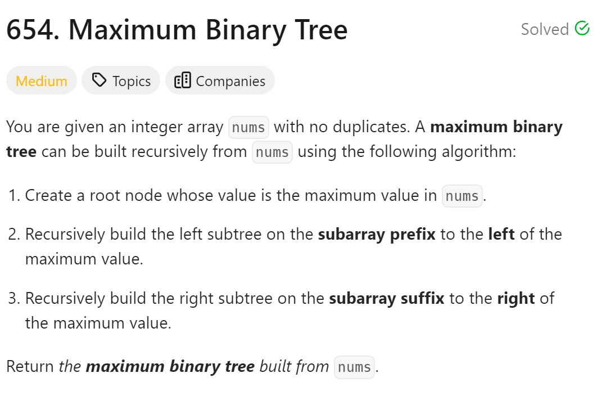
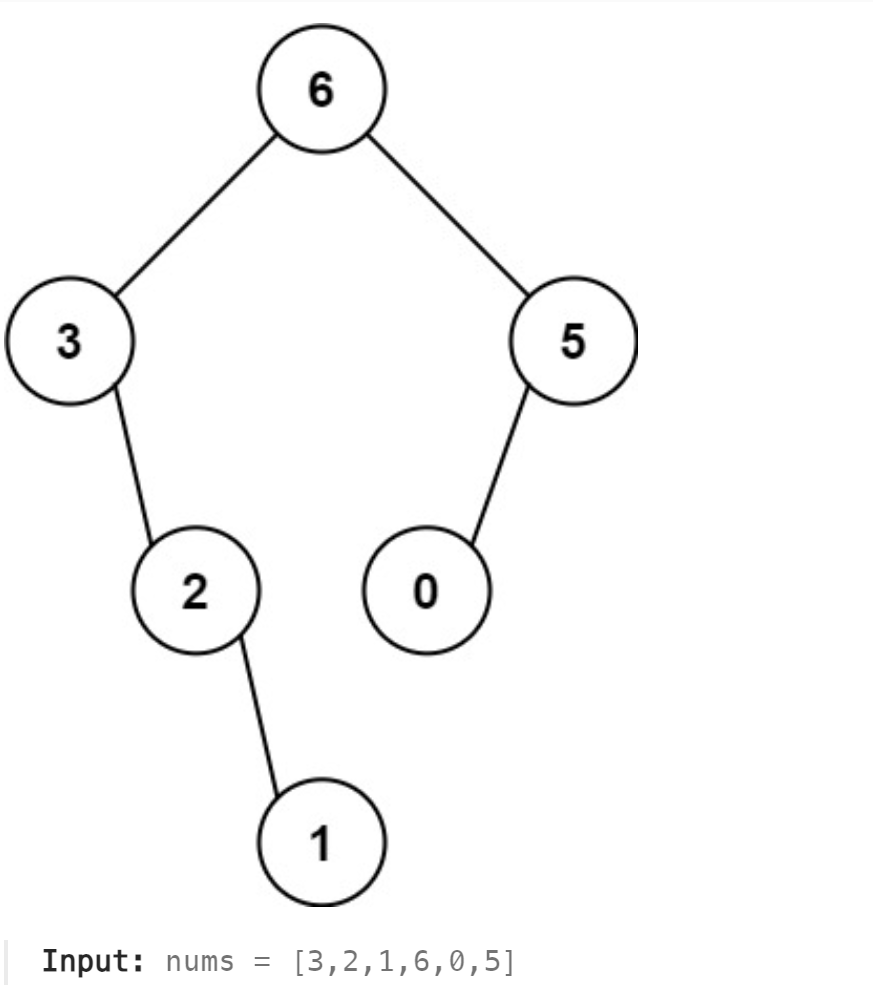

# 654. Maximum Binary Tree



## 难点
答案可以更优化，创建另一个函数，使用int left和int right作为分界，不需要每次递归都创建新的数组，减少空间复杂度。

## C++
``` C++
TreeNode* constructMaximumBinaryTree(vector<int>& nums) {
    if (nums.size()==0) return nullptr;
    int maxvalue=0,maxindex=0;
    for (int i=0;i<nums.size();i++)
    {
        if (nums[i]>maxvalue)
        {
            maxvalue=nums[i];
            maxindex=i;
        }
    }
    TreeNode* root=new TreeNode(maxvalue);
    vector<int> leftnums(nums.begin(),nums.begin()+maxindex);
    vector<int> rightnums(nums.begin()+maxindex+1,nums.end());
    root->left=constructMaximumBinaryTree(leftnums);
    root->right=constructMaximumBinaryTree(rightnums);
    return root;
}
```

## Python
``` Python
def constructMaximumBinaryTree(self, nums: List[int]) -> Optional[TreeNode]:
    if not nums:
        return None
    maxvalue,maxindex=0,0
    for i in range(len(nums)):
        if nums[i]>maxvalue:
            maxvalue=nums[i]
            maxindex=i
    root=TreeNode(maxvalue)
    leftnums=nums[:maxindex]
    rightnums=nums[maxindex+1:]
    root.left=self.constructMaximumBinaryTree(leftnums)
    root.right=self.constructMaximumBinaryTree(rightnums)
    return root
```