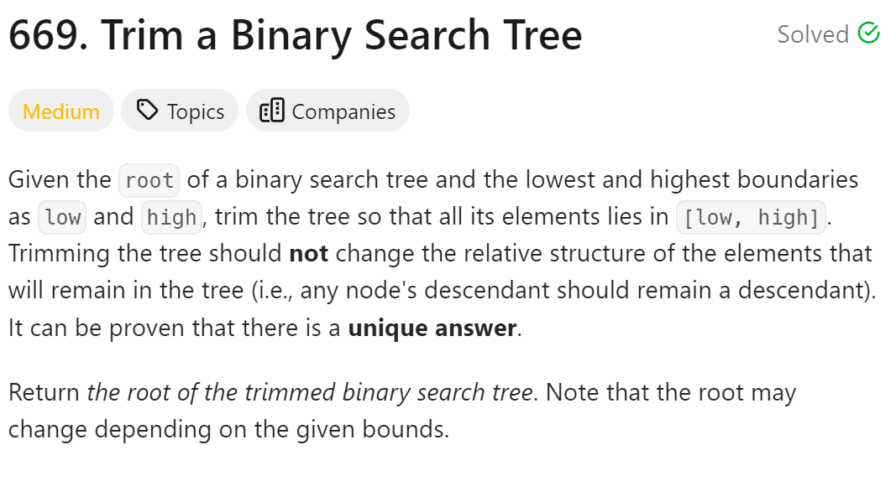
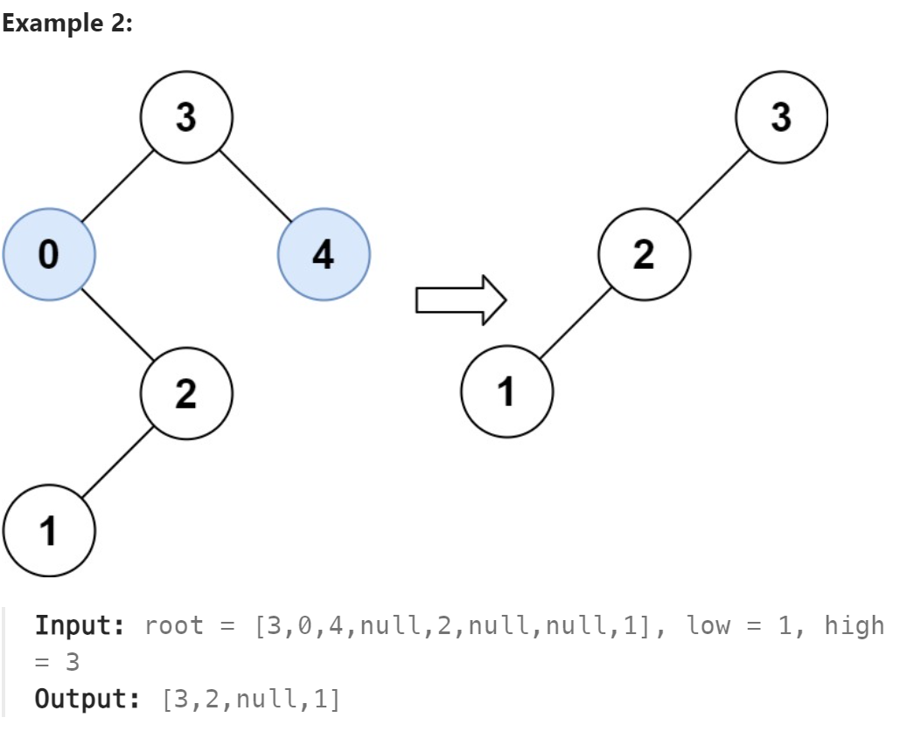

# 669. Trim a Binary Search Tree



## 难点
在删除节点的时候要保留其有效的子树

## C++
``` C++
class Solution {
public:
    TreeNode* trimBST(TreeNode* root, int low, int high) {
        if (!root) return root;
        if (root->val<low)
        {
            TreeNode* right=trimBST(root->right,low,high);
            return right;
        }
        if (root->val>high)
        {
            TreeNode* left=trimBST(root->left,low,high);
            return left;
        }
        root->left=trimBST(root->left,low,high);
        root->right=trimBST(root->right,low,high);
        return root;
    }
};
```

## Python
``` Python
class Solution:
    def trimBST(self, root: Optional[TreeNode], low: int, high: int) -> Optional[TreeNode]:
        if not root:
            return root
        if root.val<low:
            right=self.trimBST(root.right,low,high)
            return right
        if root.val>high:
            left=self.trimBST(root.left,low,high)
            return left
        root.left=self.trimBST(root.left,low,high)
        root.right=self.trimBST(root.right,low,high)
        return root
```