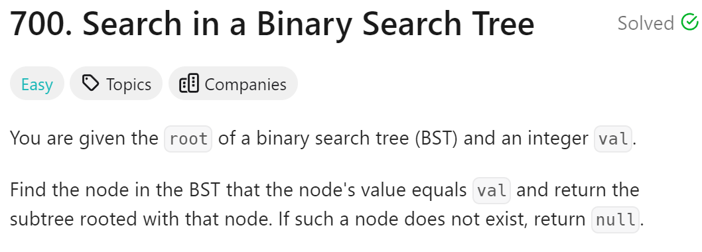
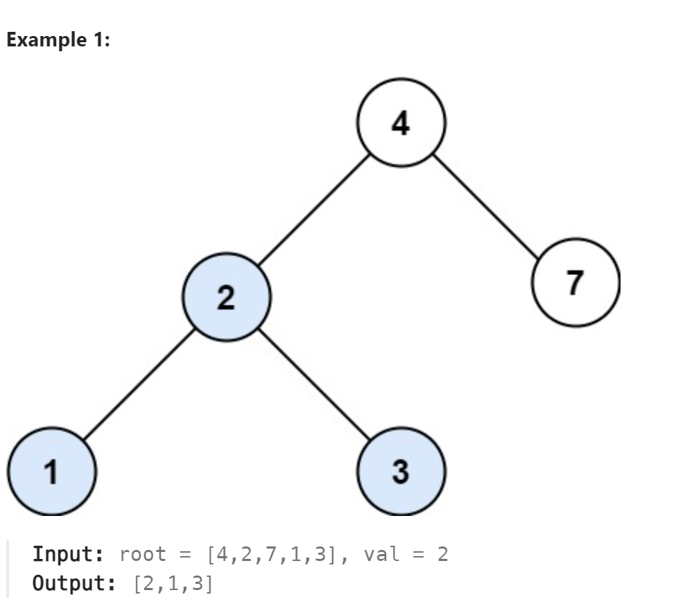

# 700. Search in a Binary Search Tree



## 难点
二叉搜索树，左节点一定比根节点小，右节点一定比根节点大

## C++
``` C++
TreeNode* searchBST(TreeNode* root, int val) {
    if (root->val==val)
        return root;
    if (root->val<val)
    {
        if (root->right)
            return searchBST(root->right,val);
        else
            return nullptr;
    }
    else
    {
        if (root->left)
            return searchBST(root->left,val);
        else
            return nullptr;
    }
}
```

## Python
``` Python
def searchBST(self, root: Optional[TreeNode], val: int) -> Optional[TreeNode]:
    if not root or root.val==val:
        return root
    if root.val<val:
        return self.searchBST(root.right,val)
    else:
        return self.searchBST(root.left,val)
```