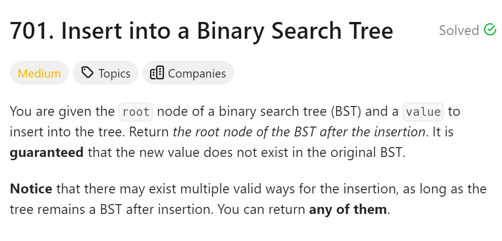
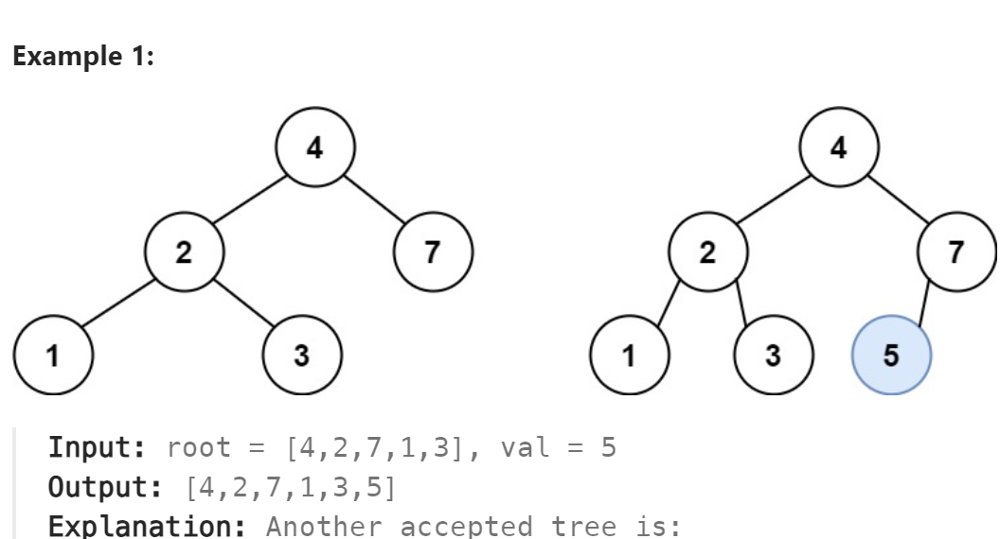

# 701. Insert into a Binary Search Tree



## 难点

## C++
``` C++
class Solution {
public:
    TreeNode* insertIntoBST(TreeNode* root, int val) {
        if (!root){
            TreeNode* node=new TreeNode(val);
            return node;
        }
        if (val<root->val) root->left=insertIntoBST(root->left,val);
        else if (val>root->val) root->right=insertIntoBST(root->right,val);
        return root;
    }
};
```

## Python
``` Python
class Solution:
    def insertIntoBST(self, root: Optional[TreeNode], val: int) -> Optional[TreeNode]:
        if not root:
            node=TreeNode(val)
            return node
        if val<root.val:
            root.left=self.insertIntoBST(root.left,val)
        if val>root.val:
            root.right=self.insertIntoBST(root.right,val)
        return root
```