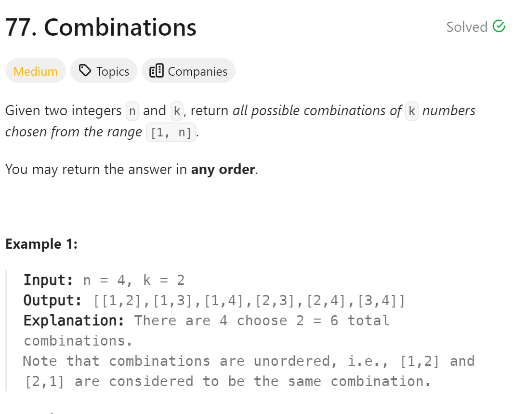

# 77. Combinations


## 难点
回溯算法

## C++
``` C++
class Solution {
public:
    vector<vector<int>> ans;
    vector<int> path;
    void backtracking(int n, int k, int startindex)
    {
        if (path.size()==k)
        {
            ans.push_back(path);
            return;
        }
        for (int i=startindex;i<=n;i++)
        {
            path.push_back(i);
            backtracking(n,k,i+1);
            path.pop_back();
        }

    }

    vector<vector<int>> combine(int n, int k) {
        backtracking(n,k,1);
        return ans;
    }
};
```
