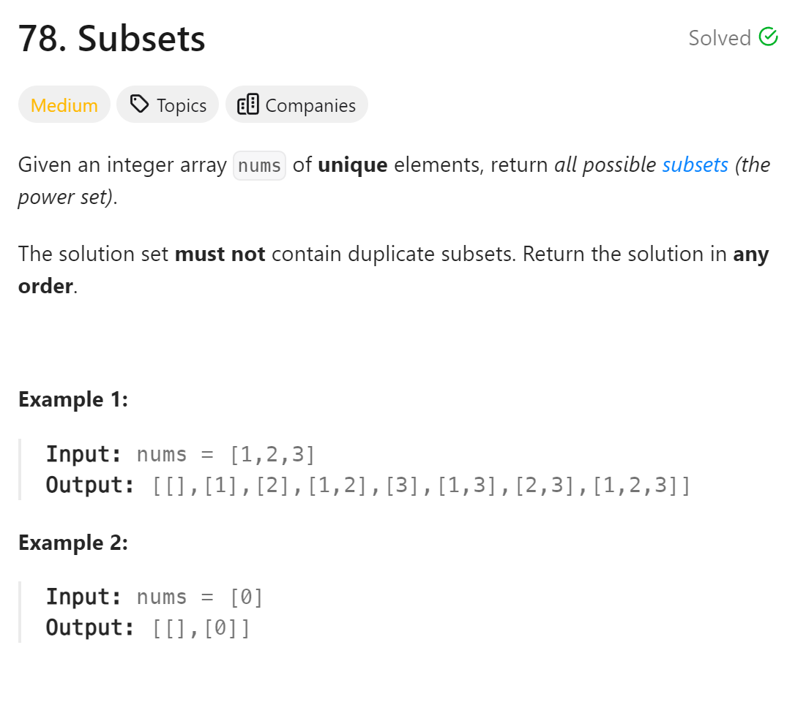

# 78. Subsets


## 难点
如果说组合问题是在求回溯树的叶节点，那么子集问题就是在求这棵树的所有节点

## C++
``` C++
class Solution {
public:
    vector<vector<int>> ans;
    vector<int> path;
    void backtracking(vector<int>& nums, int startIndex)
    {
        ans.push_back(path);
        if (startIndex>=nums.size())
            return;
        for (int i=startIndex;i<nums.size();i++)
        {
            path.push_back(nums[i]);
            backtracking(nums, i+1);
            path.pop_back();
        }
    }

    vector<vector<int>> subsets(vector<int>& nums) {
        backtracking(nums,0);
        return ans;
    }
};
```

## Python
``` Python
class Solution:
    def backtracking(self,nums,startIndex,ans,path):
        ans.append(path[:])
        if startIndex>=len(nums):
            return
        for i in range(startIndex,len(nums)):
            path.append(nums[i])
            self.backtracking(nums,i+1,ans,path)
            path.pop()

    def subsets(self, nums: List[int]) -> List[List[int]]:
        ans=[]
        path=[]
        self.backtracking(nums,0,ans,path)
        return ans
```