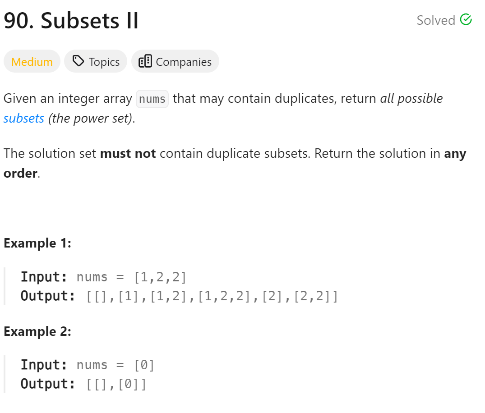

# 90. Subsets II


## 难点
要去重，使用used数组，采用树层去重的方法

## C++
``` C++
class Solution {
public:
    vector<vector<int>> ans;
    vector<int> path;
    void backtracking(vector<int>&nums,vector<bool>&used, int startIndex)
    {
        ans.push_back(path);
        if (startIndex>=nums.size())
            return;
        for (int i=startIndex;i<nums.size();i++)
        {
            if (i>0&&used[i-1]==false&&nums[i]==nums[i-1])
                continue;
            used[i]=true;
            path.push_back(nums[i]);
            backtracking(nums,used,i+1);
            path.pop_back();
            used[i]=false;
        }
    }

    vector<vector<int>> subsetsWithDup(vector<int>& nums) {
        vector<bool> used(nums.size(),false);
        sort(nums.begin(),nums.end());
        backtracking(nums,used,0);
        return ans;
    }
};
```

## Python
``` Python
class Solution:
    def backtracking(self,ans,path,used,nums,startIndex):
        ans.append(path[:])
        if startIndex>=len(nums):
            return
        for i in range(startIndex,len(nums)):
            if i>0 and nums[i]==nums[i-1] and used[i-1]==False:
                continue
            used[i]=True
            path.append(nums[i])
            self.backtracking(ans,path,used,nums,i+1)
            path.pop()
            used[i]=False

    def subsetsWithDup(self, nums: List[int]) -> List[List[int]]:
        ans=[]
        path=[]
        used=[False]*len(nums)
        nums.sort()
        self.backtracking(ans,path,used,nums,0)
        return ans
```