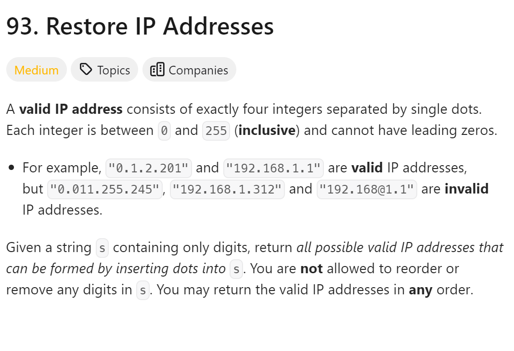
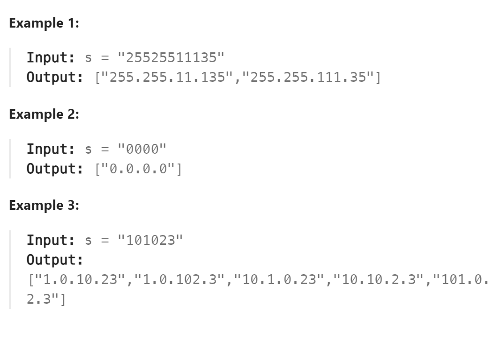

# 93. Restore IP Addresses



## 难点
这是一个切割问题，用回溯算法

## C++
``` C++
class Solution {
public:
    vector<string> ans;
    string path;
    void backtracking(string s, int startIndex,int num)
    {
        if (num>4) return;
        if (startIndex>=s.size()&&num==4)
        {
            ans.push_back(path.substr(0,path.size()-1));
            return;
        }
        for (int i=startIndex;i<s.size();i++)
        {
            string str="";
            if (isValid(s,startIndex,i))
            {
                str=s.substr(startIndex,i-startIndex+1);
                path+=str;
                path+=".";
                num++;
            }
            else
                return;
            backtracking(s,i+1,num);
            path.erase(path.size()-str.size()-1,str.size()+1);
            num--;
        }
    }

    bool isValid(string s,int start,int end)
    {
        string str=s.substr(start,end-start+1);
        if (str[0]=='0'&&end-start>0) return false;
        int cur=stoi(str);
        if (cur>255) return false;
        return true;
    }

    vector<string> restoreIpAddresses(string s) {
        backtracking(s,0,0);
        return ans;
    }
};
```
