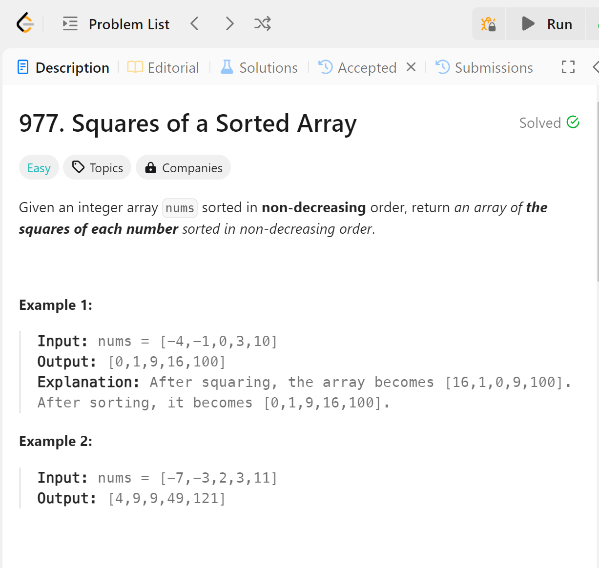

# 977 Squares of a Sorted Array


## 难点
对于C++而言，此题难点在于vector的初始化，如果使用最简单的初始化+push_back操作，会让vector的操作时间过长。所以在初始化的时候就先给每个元素申明内存位置，再使用倒序的for循环和two pointer算法来遍历整个数组。

## C++
``` C++
vector<int> sortedSquares(vector<int>& nums) {
    vector<int> ans(nums.size(), 0);
    int left=0;
    int right=nums.size()-1;
    for (int i=nums.size()-1;i>=0;i--)
    {
        if (abs(nums[left])<abs(nums[right]))
        {
            ans[i]=nums[right]*nums[right];
            right--;
        }
        else
        {
            ans[i]=nums[left]*nums[left];
            left++;
        }
    }
    return ans;
}
```

## Python
``` python
def sortedSquares(self, nums: List[int]) -> List[int]:
    res = [0]*len(nums)
    left=0
    right=len(nums)-1

    for i in range(len(nums)-1,-1,-1):
        if abs(nums[left]) > abs(nums[right]):
            res[i]=nums[left]**2
            left+=1
        else:
            res[i]=nums[right]**2
            right-=1
    return res
```
