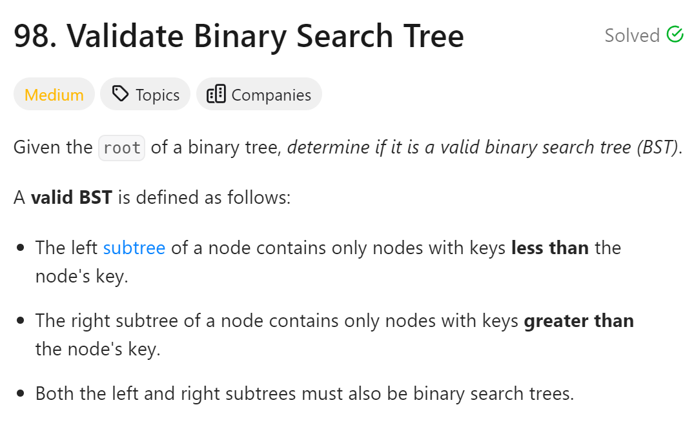
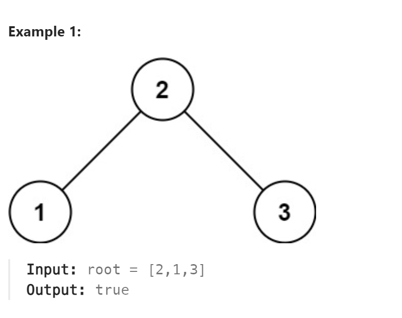

# 98. Validate Binary Search Tree



## 难点
本题的做法应该是采用中序遍历，看是否构成一个从小到大的序列。
直接比较当前节点的左右子节点，会有错误情况被漏掉。比如左孙子结点比右孙子结点大

## C++
``` C++
long long maxvalue=LONG_MIN;
bool isValidBST(TreeNode* root) {
    if (!root) return true;
    bool left=isValidBST(root->left);
    if (maxvalue<root->val) maxvalue=root->val;
    else return false;
    bool right=isValidBST(root->right);
    return left&&right;
}
```

## Python
``` Python
class Solution:
    def __init__(self):
        self.maxValue=float('-inf')

    def isValidBST(self, root: Optional[TreeNode]) -> bool:
        if not root:
            return True
        left=self.isValidBST(root.left)
        if self.maxValue<root.val:
            self.maxValue=root.val
        else:
            return False
        right=self.isValidBST(root.right)
        return left and right
```