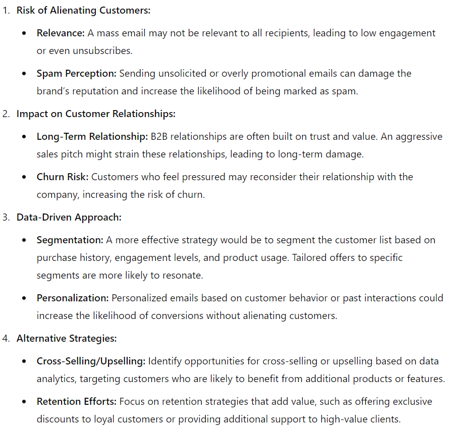

### Interview Query Pre-Launching Shows
Let’s say that you are working as a data scientist at Amazon Prime Video, and they are about to launch a new show, but first want to test the launch on only 10,000 customers first

How do we go about selecting the best 10,000 customers for the pre-launch?

What would the process look like for pre-launching the TV show on Amazon Prime to measure how it performs?
**Answer:**
To select the best 10,000 customers, the first things we wanna do is to recognizing our goals. 
**Step 1 recognizing our goals**
    1. Test the performance of the new show, eg.user engagement, viewer number, tecnical performance...
    2. estimate the impact of the show of the whole amazon prime users.
   
**Step 2 customer segmentation**
    1. If our goal is to test the performance of the new show, to get sufficient data, we can use historical data and choose the group people who are the target customer of this type of show. Within such group of people, we would like to randomly select from the whole group to avoid any bias.
    2. If our goal is to estimate the impact on whole prime users, we can use Strategy Sampling to make sure the sample could represent the who population.
   
**Step 3 A/B testing**
    1. after selecting our sample, we could conduct a A/B test, we would divide the 10,000 selected customers into control and test groups, and we will make sure the two group are independent.
   
**Step 4 metrics**
We would measure KPIs such as viewership numbers, engagement rates and technical performance. We could also conduct some survey to get some feedback.To compare the key performance indicators (KPIs) between the test group and the control group, we would use statistical tests such as z-test or t-test. These tests help us determine if there are significant differences in the metrics, providing insights into the show's potential success.

Define Comparison Method:
We would employ z-test or t-test to compare the KPIs such as viewership numbers, engagement rates, customer feedback, and technical performance between the test and control groups.

    Z-test: This test is suitable when we have a large sample size (n > 30) and the population variance is known. It helps in comparing the means of two groups.
    T-test: This test is used when the sample size is smaller (n <= 30) or the population variance is unknown. It also compares the means of two groups but is more appropriate for smaller samples.

### Interview Query Estimating D
**Question**：Given 𝑁 samples from a uniform distribution [0,𝑑], how would you estimate 𝑑?
**Answer** Because it's uniformly distribute, average of all the sample would close to the half of d, bigger sample size, more accurate result. Thus, the answer would be 2*AVG(n)

### Interview Query
**Question:**
Let’s say that you’re a data scientist working on the marketing team of a B2B SAAS business.

We’re nearing the end of the quarter and are missing revenue expectations by 10%. An executive asks the email marketing person to send out a huge email blast to your entire customer list asking them to buy more products.

Is this a good idea? Why or why not?

**Answer**
First of all, we are a Software as a Service company. And our customers are businesses, not regular consumers. Then such a form of company, when we send out purely promotional emails to our customers, the result will be relatively less effective because fewer customers will have impulse spending behavior.

Since this email is not specific to any customer, customers that do not find the email relevant could unsubscribe or ignore the email totally, thereby reducing the subscriber count or email open rate. When repeated, large email blasts could degrade the performance of emails in future campaigns.

A better solution is to identify specific customer groups and curate email campaigns targeted for them. For example, we can look for customers that are more inclined to purchase additional products or related products. Customers that are reaching their license limit could be sent a marketing email to sell them more licenses. We can analyze our existing customer base to see what products are commonly bought together, or in their customer lifecycle, to cross or upsell existing customers additional products. We can measure this effectiveness by analyzing click-through rates in links within the email.

This revenue can be broken down into various sources, for example new, existing and churned customers. In addition to sending emails to existing subscribers, we can also consider acquiring new subscribers or emailing churned subscribers, but whatever which kind of customer they are, we have to send different emails according to the different types of customers to avoid ineffective promotion.

### Question: How you would evaluate the effect on engagement of teenage users when their parents join Facebook?
**Clarify the Problem:** The goal is to measure whether the engagement of teenage users increases, decreases, or remains unchanged when their parents join the platform. Engagement can be measured through **key metrics** such as:

Number of posts
Interaction frequency (e.g., likes, comments, shares)
Time spent on the platform

These metrics should be tracked over a specified time period to observe any shifts in behavior.
Observational Study Design: Since you cannot control or force parents to join Facebook, and involving users in a controlled experiment may introduce bias (if users know they are part of an experiment, they may act differently), an observational study would be the most appropriate approach. This would allow for the collection of real-world data without intervening in the natural behavior of users.

Cohort Segmentation: Create two groups for comparison:

Cohort 1: Teenage users whose parents have recently joined Facebook.
Cohort 2: Teenage users whose parents are not on Facebook (or have not recently joined).

**Collect data：**
Establish a baseline for engagement metrics (e.g., posts, likes, time spent) for both cohorts before the parents join Facebook.
Track these metrics over time (for example, one month before and three months after the parents join).
**Control for Confounding Variables:** Ensure that the study controls for other factors that may influence teenage engagement. For example:

Platform-wide changes (e.g., a new feature launch or algorithm update).
External events (e.g., school holidays or significant social trends).

Analysis: Conduct a **difference-in-differences analysis** to compare engagement changes in the two cohorts. This statistical method will help determine whether any observed changes in engagement can be attributed to parental presence, while controlling for time effects and cohort differences.

Additionally, running a **regression analysis** with interaction terms can provide insights into how various factors (e.g., age, gender, and time spent on the platform) may moderate the effect of parents joining Facebook on teen engagement.

### A team wants to A/B test multiple different changes through a sign-up funnel.

For example, on a page, a button is currently red and at the top of the page. They want to see if changing a button from red to blue and/or from the top of the page to the bottom of the page will increase click-through.

How would you set up this test?