## SQL
### SQL Window function 
#### 过去三笔订单
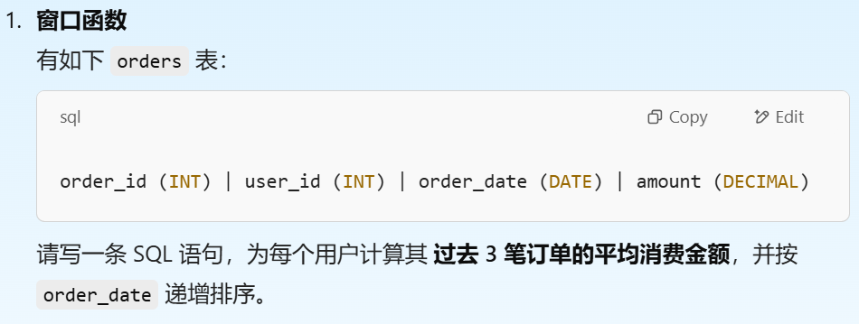
``` sql
SELECT order_id,
        user_id,
        order_date,
        amount,
        AVG(amount) OVER (
            PARTITION BY user_id 
            ORDER BY order_date
            ROWS BETWEEN 2 PRECEDING AND CURRENT ROW
                        ) AS avg_last3
FROM orders
ORDER BY order_date;
```
#### 连续活跃天数
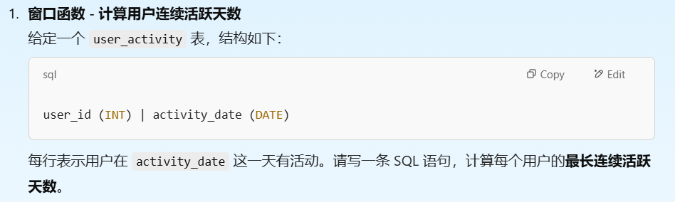
```sql
WITH cte AS(
        SELECT user_id,
                activity_date,
                activity_date - INTERVAL ROW_NUMBER() OVER(PARTITION BY user_id ORDER BY activity_date) DAY AS grouped_date
        FROM user_activity
);

SELECT user_id, COUNT(*) AS longest_active
FROM cte
GROUP BY user_id, grouped_date
ORDER BY 2 DESC
```

### SQL数据处理
#### 去重

``` SQL
WITH date_rank AS(
    SELECT *, RANK() OVER(
                        PARTITION BY customer_id
                        ORDER BY updated_at DESC
                                ) AS rn
FROM customers
)
SELECT *
FROM date_rank
WHERE rn = 1
```
#### SQL 查找缺失日期
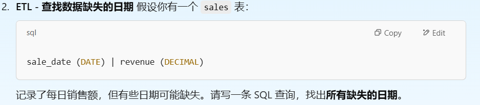
``` sql


```

## Python
### Pandas数据处理
#### 计算均值
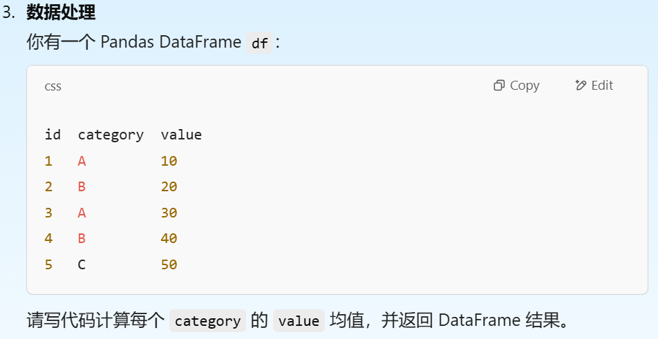
``` python
import pandas as pd

# 创建 DataFrame
data = {'id': [1, 2, 3, 4, 5], 
        'category': ['A', 'B', 'A', 'B', 'C'], 
        'value': [10, 20, 30, 40, 50]}
df = pd.DataFrame(data)

result = df.groupby('category', as_index=False)['value'].mean()
```


## Statistic
### 统计
#### 正态分布
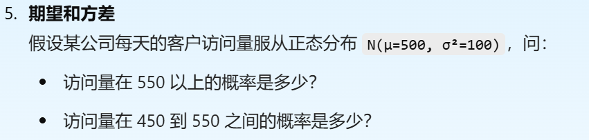
$$
Z = \frac{X-\mu}{\sigma}
$$
用公式计算，然后去表格里面找z的值，或者用python function计算
``` python
from scipy.stats import norm

mu = 500  # 均值
sigma = 10  # 标准差 (σ²=100, 所以 σ=10)

# P(X > 550)
p1 = 1 - norm.cdf(550, mu, sigma)

# P(450 < X < 550)
p2 = norm.cdf(550, mu, sigma) - norm.cdf(450, mu, sigma)
```
#### 泊松分布
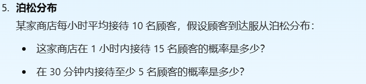
``` python
from scipy.stats import poisson

##poisson.pmf用于计算P（x=k)
p_15 = poisson.pmf(15, 10)
##poisson.cdf用于计算P（x<k)
## 因为是30分钟，所以平均值是5，因为cdf用于小于，所以 <5 就等于1 - >= 4
p_gre_5 = 1 - poisson.cdf(4, 5)


```
#### 中心极限定理


#### 贝叶斯定理
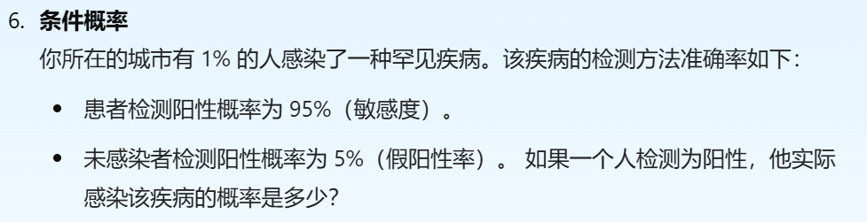

🟥我们要计算P(Disease|Positive)🟥
$$P(A|B) = \frac{P(B|A) P(A)}{P(B)}$$

$P(A'Disease') = 1\%$
$P(\neg A'health') = 99\%$
$P(B|A) = 95\%$  这个是P(Positive|Disease)，实际患病的人检测为阳性的概率
用全概率公式计算出P(B)

$P(B) = P(B|A)P(A) + P(B|\neg A)P(\neg A)$

## ML Modeling
### 模型评估
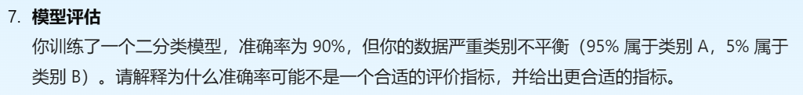
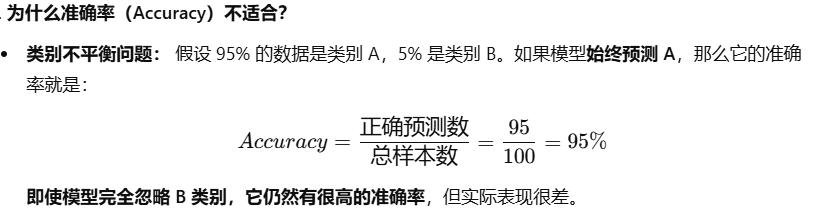
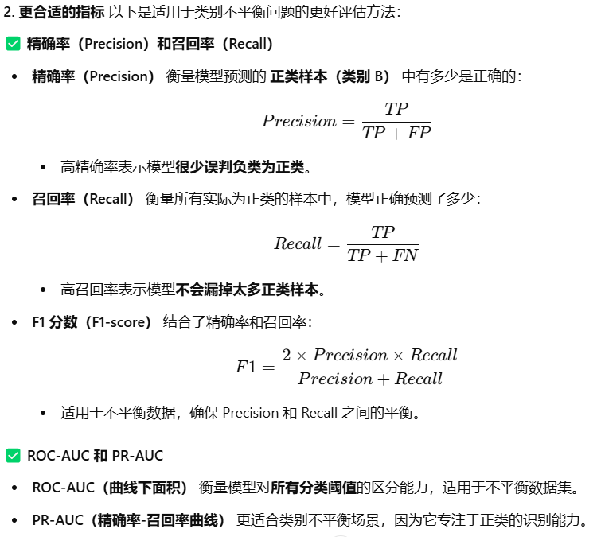

### Lasso/Ridge regression
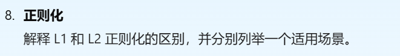
L1正则化是**Lasso regression**,用于高纬度时筛选重要的特征，会让一些特征的权重为0，缺点是容易忽略一些重要特征。

L2正则化是**ridge regression**，会降低一些特征的权重而不是将其设为0。适用于每个特征都有贡献但是需要防止过拟合，例如小样本训练深度学习模型。

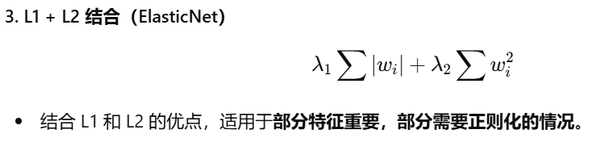

### ML 模型选择


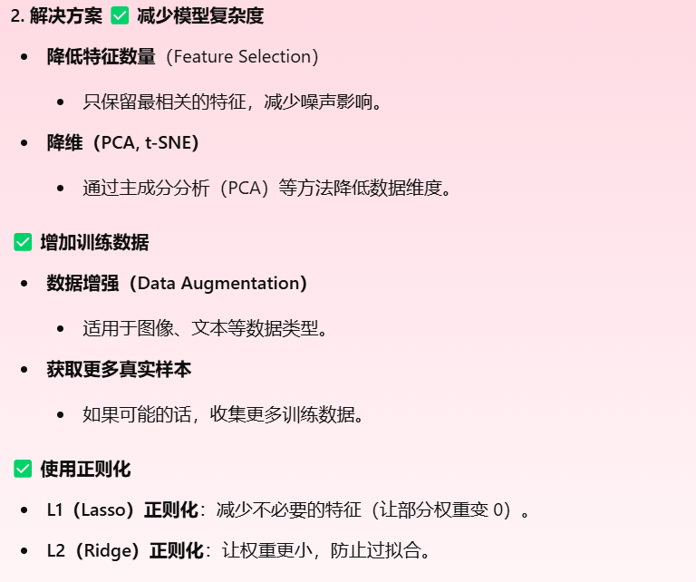
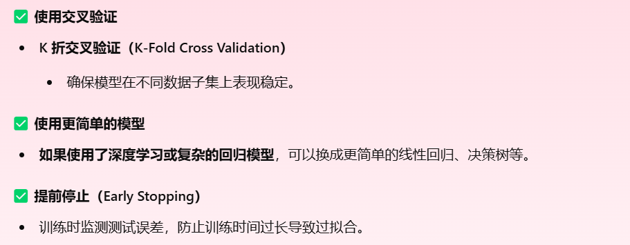


## AB test
### Test Hypothesis
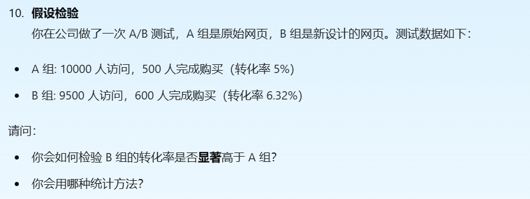

$H_0: P_A = P_B$
 $H_1: P_B > P_A$
 We calculate Z_score and standard error.
 ``` python
 import numpy as np
from scipy.stats import norm

# 观察值
n_A, n_B = 10000, 9500  # 访问人数
x_A, x_B = 500, 600  # 购买人数
p_A, p_B = x_A / n_A, x_B / n_B  # 转化率

# 计算合并转化率
p_combined = (x_A + x_B) / (n_A + n_B)

# 计算标准误差
SE = np.sqrt(p_combined * (1 - p_combined) * (1/n_A + 1/n_B))

# 计算 Z 统计量
Z_score = (p_B - p_A) / SE

# 计算 p 值（右尾检验，单尾检验）
p_value = 1 - norm.cdf(Z_score)
```