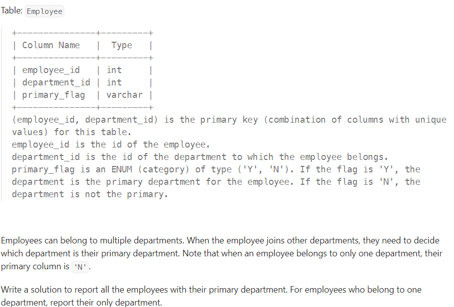
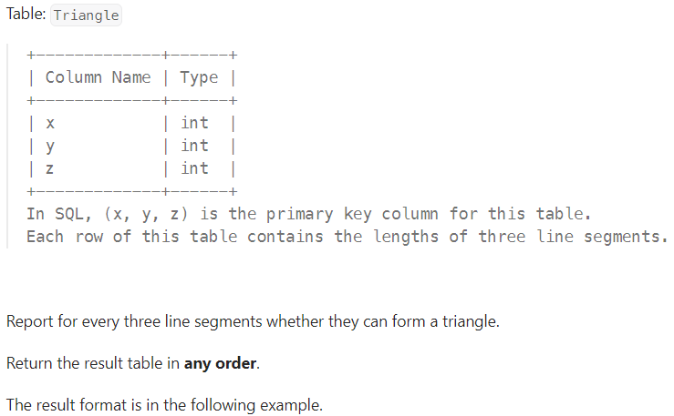
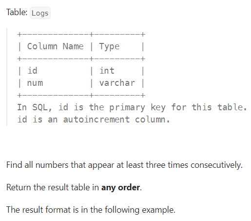
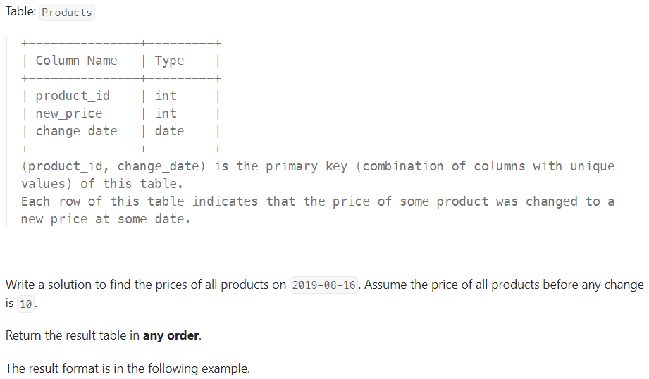
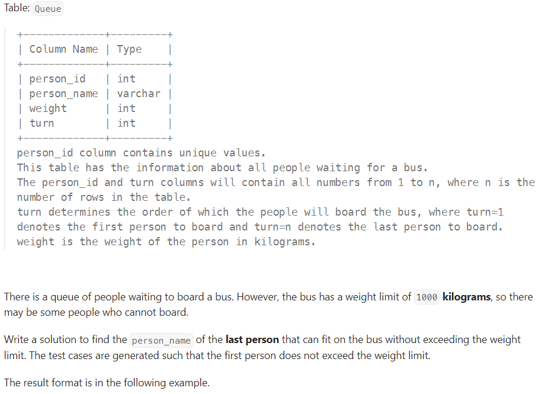
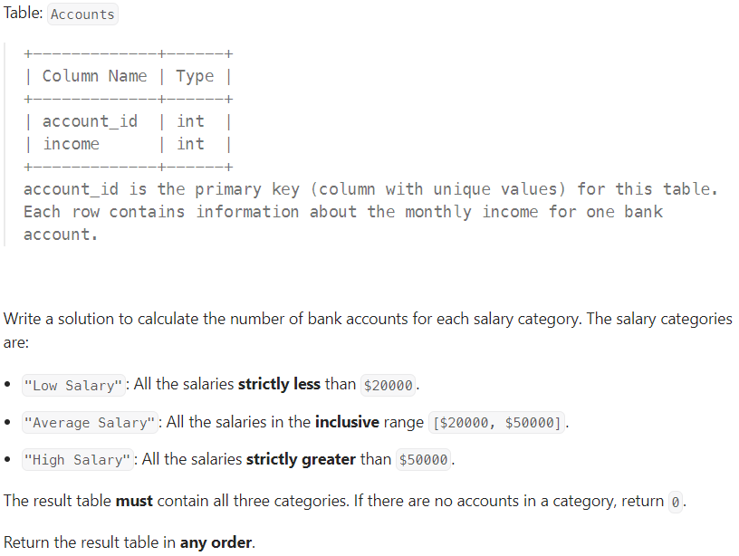
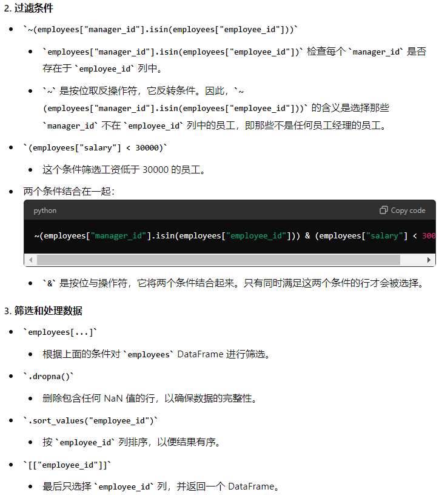

### 1193. Monthly Transactions I
``` mysql
SELECT SUBSTR(trans_date,1,7) AS month,
        country,
        COUNT(id) AS trans_count,
        SUM(IF(state = "approved",1 ,0)) AS approved_count,
        SUM(amount) AS trans_total_amount,
        SUM(IF(state = "approved",amount ,0)) AS approved_total_amount
FROM Transactions
GROUP BY 1, 2
```

**提取日期的年，月：**
方法1：SUBSTR(trans_date,1,7) 
方法2：left(trans_date,7)
方法3：DATE_FORMAT(trans_date, '%Y-%m')
**count 内容为approved的数量**
用SUM和IF,IF判断内容为approved，就设置为1，total amount也是如此，如果为approved就设置为amount。

### 1174. Immediate Food Delivery II
``` mysql
SELECT ROUND(AVG(order_date = customer_pref_delivery_date)*100, 2) AS immediate_percentage
FROM Delivery
WHERE  (customer_id, order_date) IN(
                                SELECT customer_id,min(order_date)
                                FROM Delivery
                                GROUP BY 1
                                )
```
**思路**: 我们要在满足特定条件的数据中，再进行一次判断，最简便的方法就是在where里面把特定条件筛选出来。上面这一题用了subquary和in来筛选出特定条件的rows。

### 550. Game Play Analysis IV
``` mysql
SELECT ROUND(COUNT(DISTINCT player_id)/(SELECT COUNT(DISTINCT player_id) 
                                            FROM Activity) 
            , 2) AS fraction
FROM Activity
WHERE (player_id, DATE_SUB(event_date, INTERVAL 1 DAY)) IN(
                    SELECT player_id, MIN(event_date)
                    FROM Activity
                    GROUP BY 1)
```
**tips:**SELECT里面用一个subquary，这样可以获取两张表里的数据。
**日期隔一天的写法**：DATE_SUB(event_date, INTERVAL 1 DAY)
**方法2：用Join**
``` mysql
SELECT ROUND(COUNT(t2.player_id)/COUNT(t1.player_id),2) AS fraction
FROM
        (SELECT player_id, MIN(event_date) AS first_login 
        FROM Activity 
        GROUP BY player_id) t1 
LEFT JOIN Activity t2
        ON t1.player_id = t2.player_id 
        AND t1.first_login = t2.event_date - 1
```
**tips**: 一张表里是第一天登录的row，第二张表里是首次登陆的第二天的row，再通LEFT join合起来，select里的内容和上面一个方法一个意思。

### Interview Query July 11，Exam Scores
题目是一张表格是每个学生和四个考试成绩，column 1 student_id, column 2 student name, column 3, exam 1 score... 然后exam 2, 3, 4.要求是转化成一个学生和他的四个成绩为一row。
``` mysql
SELECT student_name,
        SUM(CASE WHEN exam_id = 1 THEN score ELSE NULL END) AS exam_1,
        SUM(CASE WHEN exam_id = 2 THEN score ELSE NULL END) AS exam_2,
        SUM(CASE WHEN exam_id = 3 THEN score ELSE NULL END) AS exam_3,
        SUM(CASE WHEN exam_id = 4 THEN score ELSE NULL END) AS exam_4
FROM exam_scores
GROUP BY student_id;
```
以上的方法使用了case when，因为需要每个学生在一个row里面，所以用了group by，而为了用group by，在select里面就需要用sum。
以下是使用if的方法，其他逻辑不变。
``` mysql
SELECT student_name,
  SUM(IF(exam_id=1, score, NULL)) AS exam_1,
  SUM(IF(exam_id=2, score, NULL)) AS exam_2,
  SUM(IF(exam_id=3, score, NULL)) AS exam_3,
  SUM(IF(exam_id=4, score, NULL)) AS exam_4
FROM exam_scores
GROUP BY student_id;
```
### Interview Query Pre-Launching Shows(case简答)
Let’s say that you are working as a data scientist at Amazon Prime Video, and they are about to launch a new show, but first want to test the launch on only 10,000 customers first

How do we go about selecting the best 10,000 customers for the pre-launch?

What would the process look like for pre-launching the TV show on Amazon Prime to measure how it performs?
**Answer:**
To select the best 10,000 customers, the first things we wanna do is to recognizing our goals. 
**Step 1 recognizing our goals**
    1. Test the performance of the new show, eg.user engagement, viewer number, tecnical performance...
    2. estimate the impact of the show of the whole amazon prime users.
   
**Step 2 customer segmentation**
    1. If our goal is to test the performance of the new show, to get sufficient data, we can use historical data and choose the group people who are the target customer of this type of show. Within such group of people, we would like to randomly select from the whole group to avoid any bias.
    2. If our goal is to estimate the impact on whole prime users, we can use Strategy Sampling to make sure the sample could represent the who population.
   
**Step 3 A/B testing**
    1. after selecting our sample, we could conduct a A/B test, we would divide the 10,000 selected customers into control and test groups, and we will make sure the two group are independent.
   
**Step 4 metrics**
We would measure KPIs such as viewership numbers, engagement rates and technical performance. We could also conduct some survey to get some feedback.To compare the key performance indicators (KPIs) between the test group and the control group, we would use statistical tests such as z-test or t-test. These tests help us determine if there are significant differences in the metrics, providing insights into the show's potential success.

Define Comparison Method:
We would employ z-test or t-test to compare the KPIs such as viewership numbers, engagement rates, customer feedback, and technical performance between the test and control groups.

    Z-test: This test is suitable when we have a large sample size (n > 30) and the population variance is known. It helps in comparing the means of two groups.
    T-test: This test is used when the sample size is smaller (n <= 30) or the population variance is unknown. It also compares the means of two groups but is more appropriate for smaller samples.

### Interview Query Empty Neighborhoods


``` mysql
SELECT name
FROM neighborhoods
WHERE id NOT IN (
    SELECT neighborhood_id
    FROM users
)
```
**TIPS**:上面的方法会好理解，两张表用NOT IN和一个subquery选出出现在一张图而不再第二张图的row，但是由于要query一边找出所有的id，所以不够有效率。以下的方法是用left join，应该是一个更efficient的方法。
``` mysql
SELECT n.name   
FROM neighborhoods AS n 
LEFT JOIN users AS u
    ON n.id = u.neighborhood_id
WHERE u.id IS NULL
```
LEFT JOIN会保留所有的左边表的row，在这里也就是neighborhoods。然后最后用where IS NULL来筛选出没有出现在右边表里的row。

### Interview Query Good Grades and Favorite Colors

``` python
import pandas as pd

def grades_colors(students_df):
    students_df = students_df[(students_df['grade']>90) &
        students_df['favorite_color'].isin(['red', 'green'])]
    return students_df
```
**tips**:def 和 return一起，[]表示df里取一部分，()可以说明and的优先级，也是isin()调用function。

### Interview Query Monthly Customer Report

``` mysql
SELECT MONTH(created_at) AS month,
    COUNT(DISTINCT user_id) AS num_customers,
    COUNT(DISTINCT t.id) AS num_orders,
    SUM(quantity*price) AS order_amt
FROM transactions t
LEFT JOIN products p
    ON t.product_id = p.id
WHERE YEAR(created_at) ='2020'
GROUP BY 1
```
### Interview Query Closest SAT Scores

``` mysql
SELECT s1.student AS one_student,
    s2.student AS other_student,
    ABS(s1.score - s2.score) AS score_diff
FROM scores s1
INNER JOIN scores s2
    WHERE s1.id != s2.id
    AND s1.id < s2.id
ORDER BY 3, 1
LIMIT 1
```
**如何cross join**
在这道题里面，我们要找成绩相差最小的两个学生，所以我们将所有学生两两配对。INNER JOIN scores s2 WHERE s1.id != s2.id
第二个重点，因为用上面这个方法同样两个人会出现两遍，所以用AND s1.id < s2.id来筛选出第一组，消除重复

### Interview Query Employee Salaries

``` mysql
SELECT name AS department_name,
        AVG(CASE WHEN salary > 100000
            THEN 1 ELSE 0 END) AS percentage_over_100k,
        COUNT(DISTINCT e.id) AS number_of_employees
FROM departments d
LEFT JOIN employees e
    ON d.id = e.department_id
GROUP BY 1
HAVING COUNT(DISTINCT e.id) >= 10
ORDER BY 2 DESC
LIMIT 3
```
**tip:**最重要的一个，当要算percentage的时候，一定要想到case when，用AVG（0，1）来计算percentage。
这里筛选id人数大于10时用了count，所以必须在group后面，所以要用having。

### Interview Query Employee Salaries

``` mysql
SELECT name, IFNULL(SUM(distance),0) AS distance_traveled
FROM users u
LEFT JOIN rides r
    ON u.id = r.passenger_user_id
GROUP BY u.id
ORDER BY 2 DESC
```
**tips**可以注意一下这种问题怎么处理0，把null变成0会更准确。

### 1633.Percentage of Users Attended a Contest
``` mysql
SELECT contest_id,
        ROUND(COUNT(user_id)/(SELECT COUNT(user_id)
                        FROM Users)*100, 2) AS percentage
FROM Register
GROUP BY 1
ORDER BY 2 DESC, 1
```
**python方法**
``` python
total_users = users["user_id"].unique()

register_grouped = (
    register.groupby("contest_id")["user_id"]
    .nunique()
    .reset_index(name="count_unique_users")
)

register_grouped["percentage"] = (
    register_grouped["count_unique_users"] / total_users
) * 100

register_grouped["percentage"] = register_grouped["percentage"].round(2)
```
小注意事项，表里的column name要加引号。

### 1211. Queries Quality and Percentage
``` mysql
SELECT query_name, 
        ROUND(AVG(rating/position),2) AS quality,
        ROUND(AVG(CASE WHEN rating < 3 THEN 1 ELSE 0 END)*100,2) AS poor_query_percentage
FROM Queries
GROUP BY query_name
```
**方法2：用 window function**
``` mysql
SELECT DISTINCT query_name,
        ROUND(AVG(rating/position) OVER(PARTITION BY query_name), 2) AS quality,
        ROUND(AVG(CASE WHEN rating < 3 THEN 1 ELSE 0 END) OVER(PARTITION BY query_name)*100, 2) AS poor_query_percentage
FROM Queries
```
### 2356. Number of Unique Subjects Taught by Each Teacher

``` mysql
SELECT teacher_id, COUNT(DISTINCT subject_id) AS cnt
FROM Teacher
GROUP BY 1
```
比较简单的一道sql题，可以主要练习一下pandas做法。
``` python
teacher_grouped = (
    teacher.groupby("teacher_id")[subject_id]
    .unique()
    .reset_index(name = "cnt")
)
```
**.numique**出来是count的结果，直接**unique**出来是给一个list，包含了unique的结果。
下面是包装成function的写法：
``` python
def count_unique_subjects(teacher: pd.DataFrame) -> pd.DataFrame:
    # Group by teacher_id and count the number of unique subject_ids
    result = teacher.groupby('teacher_id')['subject_id'].nunique().reset_index()
    result.rename(columns={'subject_id': 'cnt'}, inplace=True)
    
    return result
```
OR
``` python
def count_unique_subjects(teacher: pd.DataFrame) -> pd.DataFrame:
    return teacher.groupby('teacher_id')['subject_id'].nunique().reset_index(name='cnt')
```

### 1141. User Activity for the Past 30 Days I

``` mysql
SELECT activity_date AS day, COUNT(DISTINCT user_id) AS active_users
FROM Activity
WHERE activity_date BETWEEN '2019-06-28' AND '2019-07-27'
GROUP BY 1
```
日期30天的另一种写法：BETWEEN date_add('2019-07-27' , INTERVAL -29 DAY) and '2019-07-27'
``` python
import pandas as pd

def user_activity(activity: pd.DataFrame) -> pd.DataFrame:

    return (activity[activity
                    .activity_date.between("2019-06-28", "2019-07-27")]

                    .rename(columns = {'activity_date': 'day',
                                       'user_id': 'active_users'})

                    .groupby('day')['active_users']
                    .nunique().reset_index())
```

### 1070. Product Sales Analysis III
``` mysql
SELECT product_id, year AS first_year, quantity, price
FROM Sales
WHERE (product_id, year) IN
                    (SELECT product_id, MIN(year) AS year
                    FROM Sales
                    GROUP BY 1)
```
### 1045. Customers Who Bought All Products
``` mysql
SELECT customer_id
FROM Customer
GROUP BY 1
HAVING COUNT(DISTINCT product_key) = (SELECT COUNT(*)
                    FROM Product)
```
**tip**要是题目里出现 "may contain duplicates rows"，那就加上distinct，面试的时候可以说dealing with duplicated entries first.

### 1731. The Number of Employees Which Report to Each Employee
``` mysql
SELECT e1.employee_id, e1.name, COUNT(e2.employee_id) AS reports_count, ROUND(AVG(e2.age)) AS average_age
FROM Employees e1
JOIN Employees e2
    ON e1.employee_id = e2.reports_to
GROUP BY 1
ORDER BY 1
```
只用join就只会包括出现在两张表里的数据，在这道题里就是有下属的manager，如果用left join，有没有人向他report都会出现在join之后的表里。


``` mysql
SELECT employee_id, department_id
FROM Employee
WHERE primary_flag = "Y"
    OR employee_id IN (
        SELECT employee_id
        FROM Employee
        GROUP BY 1
        HAVING COUNT(*) = 1
    )
```
逻辑题


SELECT x, y, z, CASE WHEN x+y > z AND x+z > y AND y+z >x THEN 'Yes' ELSE 'No' END AS triangle
FROM Triangle
不是所有题都有巧法，想不到就笨办法，做得出来再说。


``` mysql
SELECT DISTINCT l1.num AS ConsecutiveNums
FROM logs l1
JOIN Logs l2
    ON l2.id = l1.id + 1
JOIN Logs l3
    ON l3.id = l1.id + 2
WHERE l1.num = l2.num AND l2.num = l3.num
```
**TIP**WHERE语句不能a = b = c，要a = b AND b = c！

### 1164. Product Price at a Given Date

``` mysql
SELECT product_id, new_price AS price
FROM Products
WHERE (product_id, change_date) IN (
    SELECT product_id, MAX(change_date)
    FROM Products
    WHERE change_date <= '2019-08-16'
    GROUP BY 1
)
UNION ALL
SELECT product_id, 10 AS Price
FROM Products
GROUP BY 1
HAVING MIN(change_date) > '2019-08-16'
```
**TIP**在两种完全不同的判断的情况下，要想到union all

### Last Person to Fit in the Bus

``` mysql
SELECT person_name
FROM (
    SELECT person_name, turn, SUM(weight) OVER(ORDER BY turn) AS cum_weight
    FROM Queue
) tmp
WHERE cum_weight <= 1000
ORDER BY turn DESC
LIMIT 1
```
**TIP:** Window function的sum是cumulative的，在OVER里面放上order就能按顺序cumulate。
**TIP2:**要选择表格里最后一个，把他反过来order然后limit 1.

### 1978. Count Salary Categories

``` mysql
SELECT 'Low Salary' AS category, 
       SUM(IF(income < 20000, 1, 0)) AS accounts_count
FROM Accounts
UNION ALL
SELECT 'Average Salary' AS category, 
       SUM(IF(income BETWEEN 20000 AND 50000, 1, 0)) AS accounts_count
FROM Accounts
UNION ALL
SELECT 'High Salary' AS category,
       SUM(IF(income > 50000, 1, 0)) AS accounts_count
FROM Accounts
```
其实直接SUM(income < 20000) 效果是一样的
**python做法**
``` python
def count_salary_categories(account: pd.DataFrame) -> pd.DataFrame:
    return pd.DataFrame({
        'category': ['Low Salary', 'Average Salary', 'High Salary'],
        'account_counts':[
            accounts[account.income < 20000].shape[0],
            accounts[(account.income <= 20000) & (account.income <= 50000)].shape[0],
            accounts[account.income > 50000].shape[0],
        ],
            })
```

这里.shape[0]作用是找到这个元组的row数，也就是起到count的作用，可以用.sum()和.count()代替。
大括号 {}：用于定义字典。
中括号 []：用于定义列表、进行布尔索引和访问 DataFrame 的列。
小括号 ()：用于调用函数、明确运算优先级和定义函数及其参数。

### 1978. Employees Whose Manager Left the Company
``` python
import pandas as pd

def find_employees(employees: pd.DataFrame) -> pd.DataFrame:
    return (
        employees
        [
            ~(employees["manager_id"].isin(employees["employee_id"]))
            & (employees["salary"] < 30000)
        ]
        .dropna()
        .sort_values("employee_id")
        [["employee_id"]]
    )
```

### 626. Exchange Seats
``` mysql
SELECT 
    id,
    CASE
        WHEN id % 2 = 0 THEN LAG(student) OVER(ORDER BY id)
        ELSE COALESCE(LEAD(student) OVER(ORDER BY id), student)
    END AS student
FROM Seat
```
方法1：用window function，当是偶数时，获取上一行student的值，当是奇数是，获取下一行的值，COALESCE在这里处理null，如果lead没有下一行了，就返回当前行student的值。


### 1341. Movie Rating
``` mysql
(SELECT name AS results
FROM Users u
JOIN MovieRating m
    ON u.user_id = m.user_id
GROUP BY u.user_id
ORDER BY COUNT(DISTINCT movie_id) DESC, 1
LIMIT 1)

UNION ALL

(SELECT title AS results
FROM Movies m
JOIN MovieRating mr
    ON m.movie_id = mr.movie_id
WHERE YEAR(created_at) = '2020' 
    AND MONTH(created_at) = 2
GROUP BY m.movie_id
ORDER BY AVG(rating) DESC, 1
LIMIT 1)
```
**tips:** UNION ALL上下都要用小括号括起来！！

``` python
import pandas as pd

def movie_rating(movies       : pd.DataFrame, 
                 users        : pd.DataFrame, 
                 movie_rating : pd.DataFrame) -> pd.DataFrame:

    ratings = movie_rating.merge(users, on='user_id', how='left')
    ratings = ratings.merge(movies, on='movie_id', how='left')

    highest_user = ratings['name'].value_counts().sort_index().idxmax()

    ratings_feb_2020 = ratings[(ratings['created_at'].dt.year == 2020) & 
                               (ratings['created_at'].dt.month == 2)]

    highest_movie = ratings_feb_2020.groupby('title')['rating'].mean().idxmax()
    
    return pd.DataFrame({'results': [highest_user, highest_movie]})
```
**pandas:**idxmax()是找到最大值的索引。ratings['name'].value_counts().sort_index()这一句代码生产了一个Series，用户的名字是索引，所以idxmax可以找到rating最多的人的名字。
dt 是 Pandas 库中的一个属性访问器，用于处理日期和时间数据


### 602. Friend Requests II: Who Has the Most Friends
``` mysql
WITH cte AS(
    (SELECT requester_id AS id
    FROM RequestAccepted)

    UNION ALL

    (SELECT accepter_id AS id
    FROM RequestAccepted)

)
SELECT id, COUNT(id) AS num
FROM cte
GROUP BY id
ORDER BY 2 DESC
LIMIT 1
```
比较复杂的问题先理解逻辑再找方法
``` python
import pandas as pd

def most_friends(request_accepted: pd.DataFrame) -> pd.DataFrame:
    res = pd.concat([request_accepted["requester_id"], request_accepted["accepter_id"]]).tolist()
    r = mode(res)
    return pd.DataFrame({"id" : [r], "num" : [res.count(r)]})
```
concat把两个column合并成一个series
.tolist()把series变成一个list
mode()获得上面list里面出现评论最高的id

### Interview Query Order Addresses
SELECT SUM(CASE WHEN (shipping_address = address)
        THEN 1
        ELSE 0
        END) / COUNT(*) AS home_address_percent
FROM transactions t
JOIN users u
    ON t.user_id = u.id
算比例，case when的内容要用sum加起来。

### Interview Query Integer to Roman
``` python
roman_symbols_values = {
        "M": 1000,
        "CM": 900,
        "D": 500,
        "CD": 400,
        "C": 100,
        "XC": 90,
        "L": 50,
        "XL": 40,
        "X": 10,
        "IX": 9,
        "V": 5,
        "IV": 4,
        "I": 1,
    }

def integer_to_roman(n):  
    roman_numeral = ""
    
    for symbol, value in roman_symbols_values.items():
        while n >= value:
            roman_numeral += symbol
            n -= value
    
    return roman_numeral

def convert_integers_to_romans(nums):
    roman_numerals = [integer_to_roman(num) for num in nums]
    return roman_numerals
```
用while遍历整个dictionary， n-= value 相当于n = value-n
### Interview Query Repeated Category Purchase
``` mysql
WITH cte AS
(
    SELECT *,
    ROW_NUMBER() OVER (PARTITION BY product_category ORDER BY id) AS row_num
    FROM purchases
)

SELECT product_name, CASE WHEN row_num = 1
                    THEN 0
                    ELSE 1
                    END AS category_previously_purchased
FROM cte
```
要熟悉写cte和window function，可以让题目简单很多。