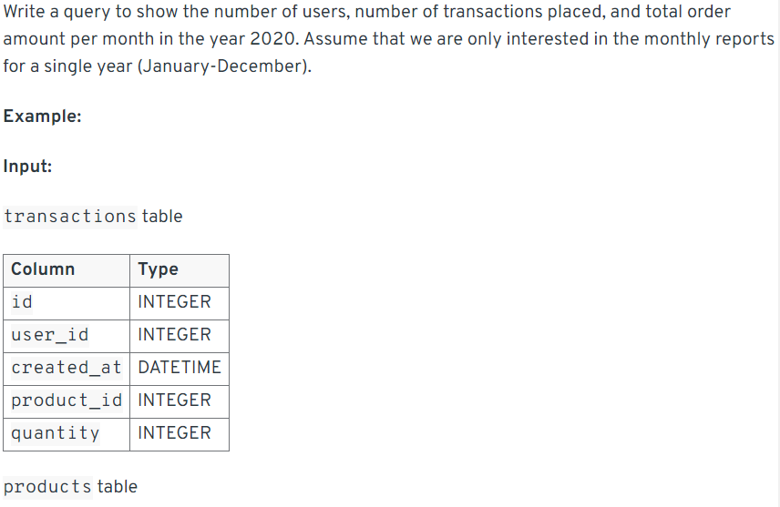

### 1193. Monthly Transactions I
``` mysql
SELECT SUBSTR(trans_date,1,7) AS month,
        country,
        COUNT(id) AS trans_count,
        SUM(IF(state = "approved",1 ,0)) AS approved_count,
        SUM(amount) AS trans_total_amount,
        SUM(IF(state = "approved",amount ,0)) AS approved_total_amount
FROM Transactions
GROUP BY 1, 2
```

**提取日期的年，月：**
方法1：SUBSTR(trans_date,1,7) 
方法2：left(trans_date,7)
方法3：DATE_FORMAT(trans_date, '%Y-%m')
**count 内容为approved的数量**
用SUM和IF,IF判断内容为approved，就设置为1，total amount也是如此，如果为approved就设置为amount。

### 1174. Immediate Food Delivery II
``` mysql
SELECT ROUND(AVG(order_date = customer_pref_delivery_date)*100, 2) AS immediate_percentage
FROM Delivery
WHERE  (customer_id, order_date) IN(
                                SELECT customer_id,min(order_date)
                                FROM Delivery
                                GROUP BY 1
                                )
```
**思路**: 我们要在满足特定条件的数据中，再进行一次判断，最简便的方法就是在where里面把特定条件筛选出来。上面这一题用了subquary和in来筛选出特定条件的rows。

### 550. Game Play Analysis IV
``` mysql
SELECT ROUND(COUNT(DISTINCT player_id)/(SELECT COUNT(DISTINCT player_id) 
                                            FROM Activity) 
            , 2) AS fraction
FROM Activity
WHERE (player_id, DATE_SUB(event_date, INTERVAL 1 DAY)) IN(
                    SELECT player_id, MIN(event_date)
                    FROM Activity
                    GROUP BY 1)
```
**tips:**SELECT里面用一个subquary，这样可以获取两张表里的数据。
**日期隔一天的写法**：DATE_SUB(event_date, INTERVAL 1 DAY)
**方法2：用Join**
``` mysql
SELECT ROUND(COUNT(t2.player_id)/COUNT(t1.player_id),2) AS fraction
FROM
        (SELECT player_id, MIN(event_date) AS first_login 
        FROM Activity 
        GROUP BY player_id) t1 
LEFT JOIN Activity t2
        ON t1.player_id = t2.player_id 
        AND t1.first_login = t2.event_date - 1
```
**tips**: 一张表里是第一天登录的row，第二张表里是首次登陆的第二天的row，再通LEFT join合起来，select里的内容和上面一个方法一个意思。

### Interview Query July 11，Exam Scores
题目是一张表格是每个学生和四个考试成绩，column 1 student_id, column 2 student name, column 3, exam 1 score... 然后exam 2, 3, 4.要求是转化成一个学生和他的四个成绩为一row。
``` mysql
SELECT student_name,
        SUM(CASE WHEN exam_id = 1 THEN score ELSE NULL END) AS exam_1,
        SUM(CASE WHEN exam_id = 2 THEN score ELSE NULL END) AS exam_2,
        SUM(CASE WHEN exam_id = 3 THEN score ELSE NULL END) AS exam_3,
        SUM(CASE WHEN exam_id = 4 THEN score ELSE NULL END) AS exam_4
FROM exam_scores
GROUP BY student_id;
```
以上的方法使用了case when，因为需要每个学生在一个row里面，所以用了group by，而为了用group by，在select里面就需要用sum。
以下是使用if的方法，其他逻辑不变。
``` mysql
SELECT student_name,
  SUM(IF(exam_id=1, score, NULL)) AS exam_1,
  SUM(IF(exam_id=2, score, NULL)) AS exam_2,
  SUM(IF(exam_id=3, score, NULL)) AS exam_3,
  SUM(IF(exam_id=4, score, NULL)) AS exam_4
FROM exam_scores
GROUP BY student_id;
```
### Interview Query Pre-Launching Shows
Let’s say that you are working as a data scientist at Amazon Prime Video, and they are about to launch a new show, but first want to test the launch on only 10,000 customers first

How do we go about selecting the best 10,000 customers for the pre-launch?

What would the process look like for pre-launching the TV show on Amazon Prime to measure how it performs?
**Answer:**
To select the best 10,000 customers, the first things we wanna do is to recognizing our goals. 
**Step 1 recognizing our goals**
    1. Test the performance of the new show, eg.user engagement, viewer number, tecnical performance...
    2. estimate the impact of the show of the whole amazon prime users.
   
**Step 2 customer segmentation**
    1. If our goal is to test the performance of the new show, to get sufficient data, we can use historical data and choose the group people who are the target customer of this type of show. Within such group of people, we would like to randomly select from the whole group to avoid any bias.
    2. If our goal is to estimate the impact on whole prime users, we can use Strategy Sampling to make sure the sample could represent the who population.
   
**Step 3 A/B testing**
    1. after selecting our sample, we could conduct a A/B test, we would divide the 10,000 selected customers into control and test groups, and we will make sure the two group are independent.
   
**Step 4 metrics**
We would measure KPIs such as viewership numbers, engagement rates and technical performance. We could also conduct some survey to get some feedback.To compare the key performance indicators (KPIs) between the test group and the control group, we would use statistical tests such as z-test or t-test. These tests help us determine if there are significant differences in the metrics, providing insights into the show's potential success.

Define Comparison Method:
We would employ z-test or t-test to compare the KPIs such as viewership numbers, engagement rates, customer feedback, and technical performance between the test and control groups.

    Z-test: This test is suitable when we have a large sample size (n > 30) and the population variance is known. It helps in comparing the means of two groups.
    T-test: This test is used when the sample size is smaller (n <= 30) or the population variance is unknown. It also compares the means of two groups but is more appropriate for smaller samples.

### Interview Query Empty Neighborhoods


``` mysql
SELECT name
FROM neighborhoods
WHERE id NOT IN (
    SELECT neighborhood_id
    FROM users
)
```
**TIPS**:上面的方法会好理解，两张表用NOT IN和一个subquery选出出现在一张图而不再第二张图的row，但是由于要query一边找出所有的id，所以不够有效率。以下的方法是用left join，应该是一个更efficient的方法。
``` mysql
SELECT n.name   
FROM neighborhoods AS n 
LEFT JOIN users AS u
    ON n.id = u.neighborhood_id
WHERE u.id IS NULL
```
LEFT JOIN会保留所有的左边表的row，在这里也就是neighborhoods。然后最后用where IS NULL来筛选出没有出现在右边表里的row。

### Interview Query Good Grades and Favorite Colors

``` python
import pandas as pd

def grades_colors(students_df):
    students_df = students_df[(students_df['grade']>90) &
        students_df['favorite_color'].isin(['red', 'green'])]
    return students_df
```
**tips**:def 和 return一起，[]表示df里取一部分，()可以说明and的优先级，也是isin()调用function。

### Interview Query Monthly Customer Report

``` mysql
SELECT MONTH(created_at) AS month,
    COUNT(DISTINCT user_id) AS num_customers,
    COUNT(DISTINCT t.id) AS num_orders,
    SUM(quantity*price) AS order_amt
FROM transactions t
LEFT JOIN products p
    ON t.product_id = p.id
WHERE YEAR(created_at) ='2020'
GROUP BY 1
```
### Interview Query Closest SAT Scores

``` mysql
SELECT s1.student AS one_student,
    s2.student AS other_student,
    ABS(s1.score - s2.score) AS score_diff
FROM scores s1
INNER JOIN scores s2
    WHERE s1.id != s2.id
    AND s1.id < s2.id
ORDER BY 3, 1
LIMIT 1
```

